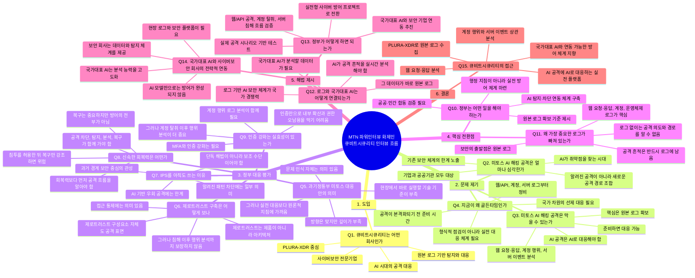

아래처럼 구성하면 **기승전결의 흐름**이 자연스럽습니다.



## 전체 질문 흐름 요약

```text
회사 소개
→ 미토스 AI 해킹 공격의 심각성
→ 막을 수 있다는 메시지
→ 지금이 골든타임이라는 문제의식
→ 정부 대응안 평가
→ 제로트러스트·IPS·회복력·인증 강화의 한계
→ 빠져 있는 핵심은 로그
→ 로그와 국가대표 AI의 결합
→ 정부가 해야 할 일
→ 큐비트시큐리티의 실전 대응 방향
```

## 방송 리듬 기준 정리

| 구간 | 질문      | 역할       | 핵심 메시지                          |
| -: | ------- | -------- | ------------------------------- |
|  1 | Q1      | 신뢰 형성    | 큐비트시큐리티는 AI 시대 사이버보안 기업         |
|  2 | Q2~Q4   | 위기 제기    | 미토스 AI 공격은 심각하지만 준비하면 막을 수 있음   |
|  3 | Q5~Q9   | 정부 대응 평가 | 방향은 의미 있지만 실전 대응 기준이 부족         |
|  4 | Q10~Q11 | 핵심 전환    | 빠져 있는 것은 원본 로그                  |
|  5 | Q12~Q14 | 국가 해법    | 국가대표 AI와 보안 기업의 전략적 연동 필요       |
|  6 | Q15     | 회사 결론    | 큐비트시큐리티는 PLURA-XDR로 이 문제를 풀고 있음 |

## 각 질문의 한 줄 목적

## Q1. 큐비트시큐리티 어떤 곳인지 소개해 주십시오. 세계적으로 드문 케이스라고 하셨는데요.

큐비트시큐리티는 **사이버보안 플랫폼 회사**입니다.

웹방화벽, 호스트 보안, 포렌식, 통합보안이벤트관리, 취약 진단 시스템을 수직 통합해
**제품과 서비스, 그리고 보안관제까지 함께 제공**하고 있습니다.

이처럼 여러 보안 기능을 하나의 플랫폼으로 통합해 직접 개발하고 운영하는 회사는
세계적으로도 드문 사례라고 보고 있습니다.


## Q2. 지금 너무 핫한 것이라서 바로 질문 드리겠습니다. 미토스 AI 해킹 공격 얼마나 심각한 건가요?

금융, 통신, 포털, ISP, IDC 같은 핵심 인프라에서
**대규모 데이터 유출 사태**가 발생할 수 있습니다.

더 나아가 기간 시설 공격으로 서비스가 멈출 수도 있고,
2003년 **1.25 인터넷 대란**처럼
우리나라 인터넷이 대규모로 마비되는 상황까지도 배제하기 어렵습니다.

## Q3. 그렇다면 막을 수 있는 건가요?

막을 수 있습니다.

미토스 AI가 최신의 **핵폭탄급 사이버 위협**인 것은 맞지만,
지금부터 준비하고 제대로 대응하면 충분히 막을 수 있습니다.

## Q4. 아직 출시되지 않았는데 어떻게 대응할 수 있다고 말씀하시는 건가요?

미토스 AI가 강력한 것은 맞지만,
우리는 이미 GPT, 클로드, 그록 같은 최신 AI를 사용하고 있습니다.

실제로 이런 AI들은 해킹 공격 분석과 대응 체계 구축에도 활용되고 있습니다.

중요한 것은 미토스 AI가 아직 영화 *미션 임파서블*의 **더 엔티티** 같은
초지성, 즉 AGI 수준은 아니라는 점입니다.

따라서 지금 보유한 AI와 보안 기술을 제대로 결합하면
출시 전이라도 충분히 대응 준비를 할 수 있는 골든타임입니다.

## Q5. 정부 대응안의 의미는 어떻게 보시나요?

전체적으로는 **미토스 AI가 위험하니 잘 대응해야 한다**는 메시지로 볼 수 있습니다.

문제 인식 자체는 의미가 있습니다.

다만 아쉬운 점은 **구체성이 부족하다**는 것입니다.
현장에서 무엇을 어떻게 준비해야 하는지에 대한 실전 대응 기준이 약합니다.

그래서 대응 내용이 다소 공허하게 느껴지고,
실망이 큰 것도 현실입니다.


아래처럼 조금 더 자연스럽게 다듬으면 좋겠습니다.

---

## Q6. 제로트러스트 구축도 대응안에 포함되어 있는데요?

제로트러스트는 **제품이 아니라 아키텍처**입니다.

예전에 침입방지시스템, 즉 IPS를 도입하면 보안이 해결되는 것처럼 접근했던 전철을 반복해서는 안 됩니다.
그런데 지금 방식은 그 흐름을 답습하는 것처럼 느껴집니다.

제로트러스트 아키텍처를 제대로 구현하려면 1년 이상 걸릴 수 있고,
비용도 상당히 많이 듭니다.

따라서 지금처럼 긴급한 상황에서는
제로트러스트 전체를 말하기보다, 먼저 적용할 수 있는 부분을 나누어 안내해야 합니다.

예를 들어 **웹방화벽, EDR, 로그 수집을 통한 가시성 확보**처럼
빠르게 적용할 수 있고 실질적인 도움이 되는 항목들이 있습니다.

그런데 이번 대응안에는 이런 구체적인 우선순위 안내가 부족합니다.

## Q7. IPS 전철을 반복해서는 안 된다는 것이 구체적으로 어떤 의미인가요?

IPS는 원래 **침입방지시스템**이라는 뜻입니다.

특정 제품 하나를 말하는 것이 아니라,
침입을 탐지하고 차단하는 시스템 전체를 의미합니다.
그런 점에서는 방화벽, 웹방화벽, EDR도 넓은 의미의 침입방지시스템으로 볼 수 있습니다.

문제는 IPS가 주로 **네트워크 패킷을 분석하는 제품**으로 굳어졌다는 점입니다.

지금은 대부분의 네트워크 통신이 암호화되어 있습니다.
그래서 일반적인 IT 환경에서는 기존 IPS나 NDR 방식으로는
실제 공격 내용을 제대로 보기 어렵습니다.

그런데도 한 번 제품화되고 인증 항목에 포함되면서,
반드시 구매해야 하는 품목처럼 자리를 잡았습니다.

제로트러스트도 이런 식으로 접근하면 안 됩니다.
이름만 앞세운 제품 도입이 아니라, 실제로 무엇을 보고 막을 수 있는지부터 따져야 합니다.

## Q8. 대응안에 신속한 회복력은요?

사이버 복원력이 필요 없다는 뜻은 아닙니다.

다만 미토스 AI 공격 대응의 핵심과는 결이 다릅니다.

해킹 공격의 핵심 피해는 결국 **데이터 유출**입니다.
2025년 주요 해킹 사건들을 보더라도, 대부분 기업 피해의 본질은 데이터 유출이었고
그 피해 규모도 매우 컸습니다.

서비스를 빨리 복구하는 것도 중요하지만,
이미 데이터가 유출된 뒤라면 복구만으로는 피해를 되돌릴 수 없습니다.

따라서 미토스 AI 대응에서는
복구보다 먼저 **침투를 탐지하고, 공격 흐름을 파악하고, 데이터 유출을 막는 체계**가 우선되어야 합니다.


## Q9. 정부는 최근 인증 강화를 내세웠는데 실효성이 있는 건가요?

실효성은 제한적이라고 봅니다.

앞서 말씀드린 작년 해킹 피해 사례를 다시 보면,
대형 통신사, 카드사, 플랫폼 기업 모두 보안 인증을 보유하고 있었습니다.

그럼에도 대규모 침해와 데이터 유출은 발생했습니다.

이 말은 인증이 없어서 문제가 생긴 것이 아니라,
인증만으로는 실제 공격을 막을 수 없다는 뜻입니다.

미토스 AI 대응에서도 인증 강화를 중심에 두는 것은 올바른 접근이 아닙니다.

이제는 인증을 통과했는지가 아니라,
실제로 공격을 탐지하고 차단할 수 있는지를 봐야 합니다.

기존 인증 중심 체계는 단계적으로 줄이고,
실전 대응 가이드와 기술 검증 중심의 새로운 패러다임으로 전환해야 합니다.


## Q10. 이번에는 정부가 어떤 일을 해야 한다고 보시나요?

가장 중요한 것은 **제1원칙으로 돌아가는 것**입니다.

해킹 대응의 본질은 결국 **로그**입니다.

정부는 먼저 **표준 로깅 가이드라인**을 준비해야 합니다.
지금은 해킹 피해를 입어도, 실제로 분석할 로그를 제대로 갖고 있지 않은 경우가 많습니다.

그러면 사고가 발생해도
누가, 언제, 어디서, 무엇을 했는지 알 수 없습니다.

결국 아무도 무슨 일이 발생했는지 모르는 상태가 되는 것입니다.


## Q11. 왜 보안에서 가장 중요하다는 로그는 없는 건가요?

로그는 **자동으로 충분히 생성되지 않습니다.**

미토스 AI가 웹 공격을 했을 때,
어떤 경로로 침투했고 어떤 데이터를 가져갔는지 확인하려면
**웹 요청, 응답 본문, 웹 서버 로그**를 분석해야 합니다.

그런데 이런 로그는 기본 설정만으로는 제대로 남지 않습니다.
설정을 통해 강제로 남기도록 해야 합니다.

문제는 현재 인증이나 점검 기준에 이런 항목이 제대로 포함되어 있지 않다는 점입니다.

그래서 실제 사고가 나도
분석할 로그가 없고, 무엇이 일어났는지 확인하지 못하는 경우가 많습니다.


### Q12. 로그와 국가대표 AI 선발 대회는 어떤 접근이 있나요?

국가 정책과 기술 해법을 연결하는 질문입니다.
국가대표 AI가 사이버 공격 로그를 실시간 분석하도록 연동해야 한다는 방향입니다.

### Q13. 정부가 어떻게 하면 되면 될까요?

실행 방안을 묻는 질문입니다.
국가대표 AI, 사이버보안 기업, 공공기관이 함께 실전 공격 시나리오를 검증해야 한다는 답으로 이어집니다.

### Q14. 국가대표 AI와 사이버보안 회사 간 전략적 연동이 필요하다는 것이군요.

진행자가 내용을 정리해 주는 확인형 질문입니다.
“맞습니다. AI 모델만으로는 안 되고, 현장의 원본 로그와 보안 플랫폼이 결합되어야 합니다”로 받으면 좋습니다.

### Q15. 큐비트시큐리티는 어떻게 접근하고 있나요?

결론 질문입니다.
PLURA-XDR이 웹 요청·응답, 계정 행위, 서버 이벤트, 원본 로그를 수집·분석하고 AI와 연동 가능한 체계를 지향한다는 메시지로 마무리합니다.
