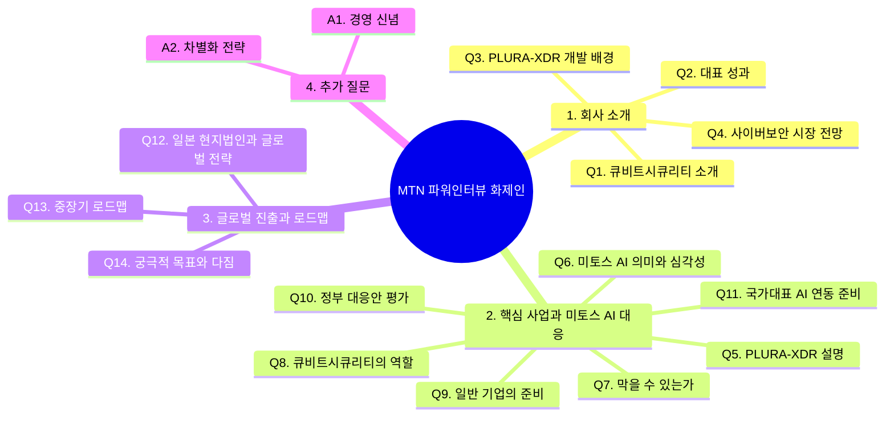

# MTN 파워인터뷰 화제인 질의응답 최종 구성안

> 출연: 큐비트시큐리티 신승민 대표  
> 방송: 2026년 5월 중 예정  
> 녹화일시: 2026년 5월 11일 월요일 오후 3시 45분  
> 녹화장소: 서울 영등포구 여의나루로 60, 여의도포스트타워 2층 스튜디오  
> 진행: 머니투데이방송 이인애 기자  
> 연출: 김성운 PD, 홍승일 PD  
> 작가: 황경희 작가  

---

## 1. 인터뷰 전체 흐름



---

## 2. 전체 질문 흐름 요약

```text
회사 소개
→ 대표 성과
→ PLURA-XDR 개발 배경
→ 사이버보안 시장 전망
→ PLURA-XDR의 실시간 해킹 대응 방식
→ 미토스 AI 해킹 공격의 심각성
→ 막을 수 있다는 메시지
→ 출시 전 대응 가능한 이유
→ 큐비트시큐리티의 역할
→ 일반 기업이 지금 해야 할 일
→ 정부 대응안 평가
→ 국가대표 AI와 사이버보안 회사의 전략적 연동
→ 일본 현지법인과 글로벌 진출
→ 중장기 로드맵
→ 궁극적 목표와 희망 메시지
```

---

## 3. 방송 리듬 기준 정리

| 구간 | 질문 | 역할 | 핵심 메시지 |
|---:|---|---|---|
| 1 | Q1~Q2 | 신뢰 형성 | 큐비트시큐리티는 기술과 운영 경험을 갖춘 사이버보안 플랫폼 회사 |
| 2 | Q3~Q4 | 시장 배경 | 공격은 AI로 고도화되고, 방어도 AI와 로그 중심으로 전환되어야 함 |
| 3 | Q5 | 제품 설명 | PLURA-XDR은 웹, 서버, PC, 계정 행위, 포렌식 증거를 통합 분석하는 플랫폼 |
| 4 | Q6~Q7 | 위기와 희망 | 미토스 AI 공격은 심각하지만 지금 준비하면 대응 가능 |
| 5 | Q8~Q9 | 실전 대응 | 공격면 최소화, 로그 생성, 실시간 분석과 차단이 핵심 |
| 6 | Q10~Q11 | 국가 해법 | 정부 대응은 방향보다 실행 기준이 중요하며, 국가대표 AI와 보안 플랫폼 연동 필요 |
| 7 | Q12~Q13 | 성장 전략 | 일본을 시작으로 글로벌 SaaS 보안 플랫폼으로 확장 |
| 8 | Q14 | 결론 | 누구나 AI 보안의 혜택을 누릴 수 있는 실시간 해킹 대응 플랫폼을 만들겠다는 다짐 |

---

# 4. 질의응답 구성안

## Q1. 바쁘신 가운데 출연해주셔서 고맙습니다. 먼저, 시청자들을 위해 큐비트시큐리티가 어떤 곳인지 간략하게 소개 부탁드립니다.

큐비트시큐리티는 **사이버보안 플랫폼 회사**입니다.

웹방화벽, 호스트 보안, 포렌식, 통합보안이벤트관리, 취약 진단 시스템을 하나의 플랫폼으로 통합해 개발하고 있습니다.

쉽게 말씀드리면, 기업에서 해킹 공격이 발생했을 때 웹, 서버, PC, 계정 행위에서 어떤 일이 있었는지 실시간으로 확인하고, 공격 흐름을 분석해 대응할 수 있도록 돕는 회사입니다.

특히 저희는 단순히 보안 제품만 개발하는 것이 아니라, 자체 플랫폼을 기반으로 보안관제와 대응 서비스까지 함께 제공하고 있습니다.

이처럼 여러 보안 기능을 하나의 플랫폼으로 통합해 직접 개발과 운영을 하고, 자체 플랫폼만으로 운영관제까지 제공하는 회사는 세계적으로도 드문 사례라고 보고 있습니다.

---

## Q2. 2014년 법인설립부터 지금까지 12년 차 기업이 되었습니다. 그동안 회사가 이룬 많은 성과 중 대표적인 성과 몇 가지 짚어주신다면요?

가장 큰 성과는 **PLURA-XDR이라는 실시간 해킹 대응 플랫폼을 상용화하고, 현장에서 계속 고도화해 왔다는 점**입니다.

보안은 아이디어만으로 되는 분야가 아닙니다. 실제 고객 환경에서 로그를 수집하고, 공격을 탐지하고, 침해 흔적을 분석하고, 다시 차단까지 연결해야 합니다.

큐비트시큐리티는 지난 12년 동안 이 과정을 꾸준히 제품화해 왔습니다.

기술적으로는 웹 요청과 응답 본문 분석, 서버 감사 로그 자동 생성, 공격 행위 상관분석, AI 기반 탐지·차단과 관련한 기술을 축적해 왔고, 관련 특허도 확보해 왔습니다.

또한 클라우드 SaaS 방식으로 보안 서비스를 제공하면서 중소기업, 공공기관, 금융·통신·제조 분야 고객도 보다 쉽게 실시간 보안을 경험할 수 있도록 해 왔습니다.

저희가 이룬 성과를 한마디로 정리하면, **로그 중심의 보안을 실제 플랫폼으로 만들고, 이를 AI 시대의 실시간 해킹 대응 체계로 발전시켜 왔다**는 것입니다.

---

## Q3. 대표 플랫폼인 ‘PLURA-XDR’을 개발하시게 된 배경은 무엇인지 궁금합니다.

PLURA-XDR을 개발하게 된 가장 큰 이유는 기존 보안 체계만으로는 실제 해킹 사고를 충분히 설명하기 어렵다는 문제의식 때문이었습니다.

보안 사고가 나면 가장 먼저 확인해야 하는 것은 “누가, 언제, 어디서, 무엇을 했는가”입니다. 그런데 실제 현장에서는 이 질문에 답할 수 있는 원본 로그가 부족한 경우가 많습니다.

웹 공격이 있었는데 웹 요청과 응답 본문이 남아 있지 않고, 서버에서 무슨 일이 있었는지 감사 로그가 부족하고, 계정 행위와 파일 변경 이력이 제대로 연결되지 않는 경우가 많습니다.

이 상태에서는 사고가 발생해도 원인을 알기 어렵고, 공격자가 어떤 경로로 들어왔는지, 어떤 데이터를 가져갔는지 확인하기 어렵습니다.

그래서 저희는 보안의 출발점을 **원본 로그 확보**로 보았습니다.

PLURA-XDR은 웹 요청·응답, 계정 행위, 서버 이벤트, PC 행위, 포렌식 증거를 함께 수집하고 분석해 공격 흐름 전체를 볼 수 있도록 만든 플랫폼입니다.

결국 PLURA-XDR은 “사고 후 확인”이 아니라, **공격이 진행되는 순간 탐지하고 차단하기 위해 개발된 플랫폼**입니다.

---

## Q4. 앞으로 사이버 보안 시장의 전망에 대해서는 어떻게 보고 계시나요?

앞으로 사이버보안 시장은 **AI 공격과 AI 방어가 맞서는 시장**으로 빠르게 바뀔 것입니다.

과거에는 공격자가 직접 취약점을 찾고, 악성코드를 만들고, 공격 경로를 구성했습니다. 하지만 이제는 AI가 취약점을 찾고, 공격 시나리오를 조합하고, 우회 방법까지 제안할 수 있는 시대가 되고 있습니다.

그렇다고 비관적으로만 볼 필요는 없습니다.

공격자가 AI를 사용한다면, 방어자도 AI를 사용해야 합니다. 중요한 것은 AI가 분석할 수 있는 충분한 증거, 즉 로그를 확보하고 있어야 한다는 점입니다.

앞으로의 보안 시장은 단순 장비 도입이나 인증 중심에서 벗어나, 실제 공격을 탐지하고 차단할 수 있는 **로그 기반 AI 보안 플랫폼** 중심으로 재편될 것으로 봅니다.

특히 웹/API, 계정, 서버, PC, 클라우드 행위를 통합해 실시간으로 분석하는 XDR 시장이 더욱 중요해질 것입니다.

---

# 5. 핵심 사업과 미토스 AI 해킹 공격 대응 전략

## Q5. 먼저, 큐비트시큐리티의 대표 플랫폼 ‘PLURA-XDR’이 화제인데요. 구체적으로 어떤 플랫폼인지, 또 어떤 방식으로 실시간 해킹 대응을 수행하는지 알기 쉽게 설명 부탁드립니다.

PLURA-XDR은 **해킹 공격의 전체 흐름을 실시간으로 보는 통합 보안 플랫폼**입니다.

해킹은 한 곳에서만 일어나지 않습니다. 처음에는 웹/API를 통해 들어오고, 이후 서버에서 명령이 실행되고, 계정이 탈취되고, 파일이 생성되거나 외부로 데이터가 나갈 수 있습니다.

PLURA-XDR은 이런 과정을 각각 따로 보는 것이 아니라, 웹, 서버, PC, 계정 행위, 포렌식 증거를 하나의 흐름으로 연결해 분석합니다.

특히 저희가 중요하게 보는 것은 **웹 요청과 응답 본문 로그**입니다.

공격자가 어떤 URL로 접근했는지, 어떤 파라미터를 보냈는지, 서버가 어떤 응답을 했는지, 그 결과 공격이 성공했는지를 확인할 수 있어야 합니다.

여기에 서버 감사 로그와 계정 행위 로그를 함께 보면, 공격자가 단순히 시도만 했는지, 실제 침투에 성공했는지, 내부에서 어떤 행위를 했는지까지 확인할 수 있습니다.

그리고 AI가 이 로그를 분석해 위험도가 높다고 판단하면 웹 차단, 계정 차단, 서버 격리 같은 자동 대응으로 연결할 수 있습니다.

쉽게 말하면 PLURA-XDR은 **해킹의 흔적을 놓치지 않고, 공격 흐름을 실시간으로 분석해 차단하는 플랫폼**입니다.

---

## Q6. 최근 세계적 이슈로 떠오른 ‘미토스 AI’의 정확한 의미는 무엇이고, 실제로 이것이 얼마나 심각한 문제가 되는지 설명 부탁드립니다.

미토스 AI는 쉽게 말해 **AI 기반 해킹 자동화 위협**으로 볼 수 있습니다.

기존에는 사람이 취약점을 찾고, 공격 코드를 만들고, 침투 경로를 조합해야 했습니다. 그런데 미토스 AI와 같은 공세형 AI가 등장하면 취약점 탐색, 공격 시나리오 생성, 우회 방법 제안, 악성코드 제작 지원 같은 과정이 훨씬 빠르게 자동화될 수 있습니다.

이것이 심각한 이유는 공격 속도와 규모가 달라질 수 있기 때문입니다.

금융, 통신, 포털, ISP, IDC 같은 핵심 인프라에서 대규모 데이터 유출이 발생할 수 있고, 더 나아가 주요 서비스가 멈추는 상황도 배제하기 어렵습니다.

과거 2003년 1.25 인터넷 대란처럼 국가 인터넷 환경이 큰 혼란을 겪었던 사례를 떠올려 보면, AI 기반 공격이 핵심 인프라를 향할 경우 그 파급력은 매우 클 수 있습니다.

다만 중요한 것은 공포가 아니라 준비입니다.

미토스 AI는 분명 심각한 위협이지만, 지금부터 원본 로그를 확보하고 AI 기반 탐지·차단 체계를 준비하면 충분히 대응할 수 있습니다.

---

## Q7. 그렇다면 막을 수는 있는 건지, 또 아직 출시 전인데 어떻게 대응할 수 있는지도 궁금합니다.

막을 수 있습니다.

미토스 AI가 강력한 것은 맞지만, 아직 영화 속 초지성 AI처럼 모든 것을 스스로 판단하고 완벽하게 공격하는 AGI 수준은 아니라고 봅니다.

그리고 우리는 이미 GPT, 클로드, 그록, 제미니 같은 최신 AI를 사용하고 있습니다.

중요한 것은 지금 우리가 가진 AI와 보안 기술을 제대로 결합하는 것입니다.

AI 공격에 대응하려면 AI가 분석할 수 있는 원본 로그가 있어야 합니다. 웹 요청과 응답, 계정 행위, 서버 이벤트, 운영체제 감사 로그가 남아 있어야 AI가 공격 의도와 침투 흐름을 판단할 수 있습니다.

그래서 지금이 골든타임입니다.

미토스 AI가 공개된 이후를 기다리는 것이 아니라, 공개 전부터 공격면을 줄이고, 로그를 남기고, AI 탐지·차단 체계를 연결해야 합니다.

또 한 가지 중요한 점은 미토스 AI 하나만 볼 문제가 아니라는 것입니다.

미토스 AI 이후에는 여러 공세형 AI가 계속 등장할 가능성이 있습니다. 따라서 우리는 하나의 AI에 대한 대응이 아니라, **공세형 AI가 확산되는 시대 전체에 대비해야 합니다.**

---

## Q8. 미토스 AI 해킹 공격 대응을 위해 앞장서고 있는 큐비트시큐리티의 역할은 무엇이라고 생각하시는지요?

큐비트시큐리티의 역할은 **AI가 해킹 공격을 분석하고 차단할 수 있는 보안 플랫폼을 제공하는 것**이라고 생각합니다.

미토스 AI 공격은 단순한 악성코드 하나만 보는 방식으로는 대응하기 어렵습니다.

서버, PC, 네트워크, 이메일, 계정 행위를 함께 보고, 공격자가 어떤 순서로 움직였는지 전체 흐름을 파악해야 합니다.

PLURA-XDR은 이 흐름을 보기 위해 만들어진 플랫폼입니다.

특히 웹 요청과 응답 본문, 서버 감사 로그, 계정 행위 로그, 포렌식 증거를 함께 분석해 공격이 단순 시도인지, 실제 침투인지, 데이터 유출로 이어지는지 판단할 수 있습니다.

큐비트시큐리티는 이 기반 위에서 GPT, 제미니, 클로드 같은 AI와 연동해 해킹 공격을 자동으로 탐지하고 차단하는 서비스를 고도화하고 있습니다.

결국 저희의 역할은 **미토스 AI 같은 공세형 AI 공격에 맞서, 방어 AI가 실제로 판단하고 대응할 수 있는 증거와 플랫폼을 제공하는 것**입니다.

---

## Q9. 일반 기업의 경우 막상 뭐부터 준비해야 할지 막막할 것 같은데요. 당장 무엇부터 준비하면 좋을까요?

세 가지부터 시작해야 합니다.

첫째, **공격면을 최소화해야 합니다.**

방화벽에서 `Any`로 열려 있는 접근을 줄이고, 외부에 노출된 웹/API, VPN, 원격접속, 관리자 페이지를 먼저 점검해야 합니다.

둘째, **모든 행위를 로그로 남겨야 합니다.**

웹 요청·응답, 로그인과 계정 행위, 서버 이벤트, 운영체제 감사 로그가 제대로 남고 있는지 확인해야 합니다.

셋째, **이 로그를 실시간으로 분석해야 합니다.**

미토스 AI 대응은 사고가 난 뒤 확인하는 방식으로는 늦습니다.

공격이 진행되는 순간 탐지하고, 위험하다고 판단되면 차단까지 연결되는 체계가 필요합니다.

정리하면, 일반 기업은 지금 바로 외부 노출 자산을 줄이고, 로그를 확보하고, 그 로그를 AI가 실시간으로 분석할 수 있는 구조로 전환해야 합니다.

---

## Q10. 얼마 전 정부에서도 미토스 대응과 관련해 AI 기반 실시간 방어 체계 구축과 글로벌 보안 협력체계 강화 등 대응안을 발표했는데요. 정부의 대응안에 대해서는 어떻게 생각하시는지요?

정부가 미토스 AI 위협을 인식하고 대응 필요성을 언급한 것은 의미가 있습니다.

다만 지금 필요한 것은 선언보다 **실전 대응 기준**이라고 생각합니다.

현장에서 기업들이 바로 실행할 수 있도록 무엇을 먼저 점검해야 하는지, 어떤 로그를 남겨야 하는지, 어떤 방식으로 AI 분석과 차단을 연결해야 하는지 구체적인 가이드가 필요합니다.

또 제로트러스트도 중요하지만, 제로트러스트는 제품이 아니라 아키텍처입니다.

이름만 앞세워 제품을 도입하는 방식으로 가면 과거 IPS 도입의 전철을 반복할 수 있습니다. IPS도 처음에는 침입을 방지한다는 좋은 취지였지만, 실제 환경에서는 암호화된 트래픽과 복잡한 웹 공격을 충분히 보기 어려운 한계가 있었습니다.

지금은 제로트러스트 전체 구축을 말하기보다, 당장 적용 가능한 웹방화벽, EDR, 로그 수집, 원본 로그 기반 가시성 확보를 우선순위로 제시해야 합니다.

또한 정부가 준비 중인 국가대표 AI와 사이버보안 회사가 바로 연동해 미토스 AI 대응 준비를 시작해야 합니다.

미토스 AI 공격은 결국 AI로 대응해야 하고, 그 AI가 판단할 수 있는 원본 로그와 보안 플랫폼이 함께 있어야 합니다.

---

## Q11. 정부가 준비 중인 국가대표 AI와 사이버보안 회사의 전략적 연동을 위해 큐비트시큐리티는 어떻게 준비 중인가요?

큐비트시큐리티는 오래전부터 **로그 중심의 AI 보안 플랫폼**을 준비해 왔습니다.

국가대표 AI가 사이버보안 분야에서 제대로 역할을 하려면 현장의 원본 로그와 연결되어야 합니다.

AI가 아무리 뛰어나도 분석할 데이터가 없으면 공격을 판단할 수 없습니다. 웹 요청과 응답 본문, 로그인 행위, 서버 이벤트, 운영체제 감사 로그가 있어야 공격 의도와 침투 경로를 분석할 수 있습니다.

PLURA-XDR은 제로트러스트 아키텍처에서 중요한 가시성의 대부분을 제공합니다.

특히 웹 요청과 응답 본문 분석, 감사 정책 기반 로그 자동 생성, 서버와 PC 행위 분석, 포렌식 증거 수집을 플랫폼 안에서 제공합니다.

또한 클라우드 SaaS 방식으로도 제공하기 때문에 누구나 바로 사용할 수 있습니다.

현재는 GPT, 제미니, 클로드 등과 연동해 해킹 공격을 자동으로 탐지하고 차단하는 제로데이 대응 서비스도 제공하고 있습니다.

이 모든 기능을 PLURA-XDR 플랫폼 안에서 쉽고 편리하게 사용할 수 있습니다.

**AI 탐지·차단을 지금 바로 경험할 수 있습니다. 1분이면 충분합니다.**

---

# 6. 글로벌 진출 현황과 중장기 로드맵

## Q12. 일본에 현지법인을 설립했다고 알고 있습니다. 구체적인 사업 진행 내용과 앞으로 진출 확대를 위한 전략은 무엇인지 함께 설명 부탁드립니다.

일본은 사이버보안 시장에서 매우 중요한 국가입니다.

일본 기업들은 안정성, 신뢰성, 장기 운영을 매우 중요하게 보고, 보안 서비스도 단순 기능보다 실제 운영 품질을 중시합니다.

큐비트시큐리티는 일본 현지법인을 기반으로 일본 시장에 맞는 파트너십과 고객 대응 체계를 준비하고 있습니다.

특히 PLURA-XDR은 클라우드 SaaS 방식으로 제공할 수 있기 때문에, 일본 고객도 복잡한 구축 프로젝트 없이 웹, 서버, 계정 행위에 대한 가시성과 AI 탐지·차단을 빠르게 경험할 수 있습니다.

일본 시장에서는 먼저 현지 파트너와 함께 고객 검증과 레퍼런스를 쌓고, 이후 금융, 제조, 통신, 공공 영역으로 확대해 나갈 계획입니다.

장기적으로는 일본을 글로벌 진출의 중요한 거점으로 삼고, 아시아 시장 전체로 확장해 나가려 합니다.

---

## Q13. 앞으로 큐비트시큐리티가 만들어갈 중장기 로드맵에 대해서도 알려주시죠.

큐비트시큐리티의 중장기 로드맵은 세 가지 방향입니다.

첫째, **PLURA-XDR의 AI 탐지·차단 기능을 계속 고도화하는 것**입니다.

웹 공격, 계정 탈취, 서버 침투, 데이터 유출 징후를 더 빠르고 정확하게 탐지하고, 위험도가 높은 공격은 자동 차단까지 연결하겠습니다.

둘째, **국가대표 AI와 같은 대형 AI 모델과 사이버보안 플랫폼의 연동을 준비하는 것**입니다.

AI가 실제 사이버 공격에 대응하려면 원본 로그와 보안 플랫폼이 필요합니다. 큐비트시큐리티는 이 연결 지점에서 중요한 역할을 하려 합니다.

셋째, **글로벌 SaaS 보안 플랫폼으로 확장하는 것**입니다.

일본 현지법인을 시작으로 해외 고객도 쉽게 사용할 수 있는 실시간 해킹 대응 서비스를 제공하고, 대한민국 보안 기술이 글로벌 시장에서도 인정받을 수 있도록 하겠습니다.

정리하면, 큐비트시큐리티는 단순한 보안 제품 회사가 아니라, AI 시대의 실시간 해킹 대응 플랫폼 회사로 성장해 나가겠습니다.

---

## Q14. 마지막으로 대표로서 꼭 이루고 싶은 궁극적인 목표와 다짐 한 말씀 부탁드립니다.

제가 이루고 싶은 목표는 분명합니다.

**대한민국에서도 세계적인 AI 보안 플랫폼 회사가 나올 수 있다는 것을 증명하는 것**입니다.

AI 공격은 앞으로 더 빨라지고 더 정교해질 것입니다. 하지만 공격이 아무리 고도화되어도 흔적은 남습니다.

그 흔적은 웹 요청과 응답, 계정 행위, 서버 이벤트, 운영체제 감사 로그와 같은 원본 로그입니다.

큐비트시큐리티는 이 로그를 기반으로 AI가 공격을 분석하고, 실시간으로 탐지하고, 필요하면 자동 차단까지 할 수 있는 플랫폼을 만들고 있습니다.

사이버보안은 이제 일부 대기업만의 문제가 아닙니다. 중소기업, 공공기관, 병원, 학교, 지역 기업 모두가 AI 보안의 혜택을 누릴 수 있어야 합니다.

저희는 누구나 쉽고 빠르게 사용할 수 있는 실시간 해킹 대응 플랫폼을 만들고, 대한민국의 사이버안보 역량을 높이는 데 기여하겠습니다.

---

# 7. 클로징 멘트

실시간 해킹 대응 플랫폼 **PLURA-XDR** 개발로 사이버 보안 시장에 새로운 기준을 제시한 기업, 큐비트시큐리티에 대해 알아봤습니다.

특히 **미토스 AI 해킹 공격**과 같은 고도화된 AI 기반 신종 사이버 위협에 선제적으로 대응하며, 차세대 보안 기술 혁신을 이끌고 있는 큐비트시큐리티의 앞으로의 행보도 주목하겠습니다.

오늘 함께해주신 신승민 대표님 고맙습니다.

---

# 8. 추가 질문 답변

## 추가 Q1. 큐비트시큐리티의 대표로서 책임감도 무거우실 것 같은데요. 회사를 이끌어오시면서 가장 중요하게 생각하는 신념은 무엇인지요?

제가 가장 중요하게 생각하는 신념은 **보안은 말이 아니라 증거로 해야 한다**는 것입니다.

보안 사고가 발생했을 때 “안전합니다”라고 말하는 것만으로는 부족합니다.

무슨 일이 있었는지, 공격자가 어디로 들어왔는지, 어떤 데이터를 봤는지, 어디까지 확산됐는지를 로그와 증거로 설명할 수 있어야 합니다.

그래서 큐비트시큐리티는 처음부터 로그에 집중해 왔습니다.

화려한 구호보다 실제 공격을 탐지하고 차단할 수 있는 기술, 사고가 발생했을 때 원인을 설명할 수 있는 증거, 고객이 바로 사용할 수 있는 플랫폼을 만드는 것이 중요하다고 생각합니다.

앞으로도 이 원칙을 지키면서 회사를 이끌어가겠습니다.

---

## 추가 Q2. 사이버보안시장의 경쟁은 앞으로도 치열할 것 같습니다. 경쟁에서 우위를 점할 큐비트시큐리티만의 차별화 전략은 무엇인지요?

큐비트시큐리티의 차별화 전략은 **로그, AI, 통합 플랫폼**입니다.

첫째, 저희는 정보보안의 제1원칙인 로그에 집중합니다.

특히 웹 요청과 응답 본문, 서버 감사 로그, 계정 행위 로그처럼 실제 공격을 설명할 수 있는 원본 로그를 중요하게 봅니다.

둘째, 이 로그를 AI와 연결합니다.

AI가 정상 행위와 공격 행위를 구분하고, 위험도가 높은 공격은 자동 차단으로 연결할 수 있도록 하고 있습니다.

셋째, 여러 보안 기능을 하나의 플랫폼으로 통합합니다.

웹방화벽, 호스트 보안, 포렌식, 통합보안이벤트관리, 취약 진단 시스템을 각각 따로 보는 것이 아니라, 공격 흐름 전체를 하나의 플랫폼에서 분석합니다.

이것이 PLURA-XDR의 핵심 경쟁력입니다.

앞으로의 보안 시장은 단순 기능 경쟁이 아니라, 실제 공격을 얼마나 빨리 보고, 얼마나 정확하게 판단하고, 얼마나 즉시 대응할 수 있는지가 중요해질 것입니다.

큐비트시큐리티는 그 방향에 가장 집중하고 있습니다.

---

# 9. 핵심 메시지 정리

## 방송용 한 문장

**AI가 공격하는 시대에는 AI로 방어해야 합니다. 그 출발점은 원본 로그이고, PLURA-XDR은 그 로그를 실시간으로 분석해 탐지와 차단으로 연결하는 플랫폼입니다.**

## 반복 가능한 핵심 표현

- 미토스 AI 공격은 심각하지만, 지금 준비하면 대응할 수 있습니다.
- 공격자는 AI를 사용합니다. 방어자도 AI를 사용해야 합니다.
- AI가 판단하려면 원본 로그가 있어야 합니다.
- 웹 요청과 응답, 계정 행위, 서버 이벤트 로그가 핵심 증거입니다.
- 미토스 AI 대응은 사고 후 복구가 아니라, 공격 진행 중 탐지와 차단입니다.
- 국가대표 AI와 사이버보안 플랫폼의 전략적 연동이 필요합니다.
- PLURA-XDR은 AI 탐지·차단을 지금 바로 경험할 수 있는 플랫폼입니다.

