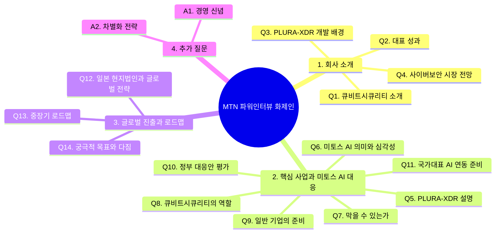

# MTN 파워인터뷰 화제인 질의응답 최종 구성안

> 출연: 큐비트시큐리티 신승민 대표  
> 방송: 2026년 5월 중 예정  
> 녹화일시: 2026년 5월 11일 월요일 오후 3시 45분  
> 녹화장소: 서울 영등포구 여의나루로 60, 여의도포스트타워 2층 스튜디오  
> 진행: 머니투데이방송 이인애 기자  
> 연출: 김성운 PD, 홍승일 PD  
> 작가: 황경희 작가  

---

## 1. 인터뷰 전체 흐름



---

## 2. 전체 질문 흐름 요약

```text
회사 소개
→ 대표 성과
→ PLURA-XDR 개발 배경
→ 사이버보안 시장 전망
→ PLURA-XDR의 실시간 해킹 대응 방식
→ 미토스 AI 해킹 공격의 심각성
→ 막을 수 있다는 메시지
→ 출시 전 대응 가능한 이유
→ 큐비트시큐리티의 역할
→ 일반 기업이 지금 해야 할 일
→ 정부 대응안 평가
→ 국가대표 AI와 사이버보안 회사의 전략적 연동
→ 일본 현지법인과 글로벌 진출
→ 중장기 로드맵
→ 궁극적 목표와 희망 메시지
```

---

## 3. 방송 리듬 기준 정리

| 구간 | 질문 | 역할 | 핵심 메시지 |
|---:|---|---|---|
| 1 | Q1~Q2 | 신뢰 형성 | 큐비트시큐리티는 기술과 운영 경험을 갖춘 사이버보안 플랫폼 회사 |
| 2 | Q3~Q4 | 시장 배경 | 공격은 AI로 고도화되고, 방어도 AI와 로그 중심으로 전환되어야 함 |
| 3 | Q5 | 제품 설명 | PLURA-XDR은 웹, 서버, PC, 계정 행위, 포렌식 증거를 통합 분석하는 플랫폼 |
| 4 | Q6~Q7 | 위기와 희망 | 미토스 AI 공격은 심각하지만 지금 준비하면 대응 가능 |
| 5 | Q8~Q9 | 실전 대응 | 공격면 최소화, 로그 생성, 실시간 분석과 차단이 핵심 |
| 6 | Q10~Q11 | 국가 해법 | 정부 대응은 방향보다 실행 기준이 중요하며, 국가대표 AI와 보안 플랫폼 연동 필요 |
| 7 | Q12~Q13 | 성장 전략 | 일본을 시작으로 글로벌 SaaS 보안 플랫폼으로 확장 |
| 8 | Q14 | 결론 | 누구나 AI 보안의 혜택을 누릴 수 있는 실시간 해킹 대응 플랫폼을 만들겠다는 다짐 |

---

# 4. 질의응답 구성안

## Q1. 바쁘신 가운데 출연해주셔서 고맙습니다. 먼저, 시청자들을 위해 큐비트시큐리티가 어떤 곳인지 간략하게 소개 부탁드립니다.

큐비트시큐리티는 **사이버보안 플랫폼 회사**입니다.

저희는 웹방화벽, 호스트 보안, 포렌식, 통합 보안 이벤트 관리, 취약점 진단 기능을 하나의 플랫폼으로 통합해 개발하고 있습니다.

또한 자체 플랫폼을 기반으로 보안관제와 실제 대응 서비스까지 함께 제공하고 있습니다.

탐지부터 분석, 차단, 대응까지 하나의 플랫폼 안에서 수행할 수 있도록 만든 회사입니다.

이처럼 여러 보안 기능을 직접 개발하고, 자체 플랫폼을 기반으로 보안관제까지 제공하는 회사는 국내외에서도 흔치 않은 사례입니다.

---

## Q2. 2014년 법인설립부터 지금까지 12년 차 기업이 되었습니다. 그동안 회사가 이룬 많은 성과 중 대표적인 성과 몇 가지 짚어주신다면요?

가장 큰 성과는 **PLURA-XDR이라는 실시간 해킹 대응 플랫폼을 상용화하고, 실제 현장에서 계속 고도화해 왔다는 점**입니다.

처음에는 통합보안이벤트관리 제품으로 출발했지만, 지금은 웹방화벽, 호스트 보안, 포렌식, 취약점 진단, AI 기반 탐지·차단 기능까지 하나의 플랫폼으로 통합했습니다.

기술력도 여러 차례 인정받았습니다.  
우수정보보안 제품과 혁신 제품으로 선정되었고, 스케일업 팁스와 초격차 분야의 R&D 지원도 받고 있습니다.

고객도 대학, 지자체, 공공기관에서 대기업, 중견기업, 중소기업까지 꾸준히 확대되고 있습니다.

또한 국내와 해외에서 여러 특허를 등록했고, 최근에는 AI 기반 해킹 공격 대응 관련 특허도 미국과 일본에 출원했습니다.

저희는 지난 12년 동안 단순한 보안 제품 회사가 아니라, 실제 해킹 대응 플랫폼 회사로 성장해 왔다고 말씀드릴 수 있습니다.

---

## Q3. 대표 플랫폼인 ‘PLURA-XDR’을 개발하시게 된 배경은 무엇인지 궁금합니다.

PLURA-XDR을 개발하게 된 출발점은 **사이버보안의 제1원칙은 로그 분석**이라는 생각이었습니다.

해킹 공격은 아무리 고도화되어도 반드시 흔적을 남깁니다.  
그 흔적이 바로 웹 요청과 응답, 로그인 행위, 서버와 운영체제 이벤트 같은 로그입니다.

그래서 저희는 처음부터 로그를 생성하고, 수집하고, 실시간으로 분석하는 통합보안이벤트관리 제품에서 출발했습니다.

이후 탐지된 공격을 실제로 차단하고 대응하기 위해 웹방화벽, EDR, 포렌식, 취약점 진단으로 영역을 확장했습니다.

그리고 지금은 AI 공격 시대입니다.  
AI가 공격한다면 방어도 AI로 해야 합니다.

그래서 PLURA-XDR은 로그 기반 분석과 AI 자동 대응을 결합한 실시간 해킹 대응 플랫폼으로 발전해 왔습니다.

---

## Q4. 앞으로 사이버 보안 시장의 전망에 대해서는 어떻게 보고 계시나요?

그동안 사이버보안 시장은 다른 산업에 비해 AI 도입이 상대적으로 더딘 편이었습니다.

하지만 미토스 AI로 대표되는 공세적 해킹 AI의 등장 가능성으로 인해 시장이 빠르게 바뀌고 있습니다.

앞으로 사이버보안 시장은 **AI 공격과 AI 방어가 맞서는 시장**이 될 것입니다.

공격자가 AI로 취약점을 찾고 공격 경로를 자동으로 조합한다면, 방어도 AI로 실시간 분석하고 자동 대응해야 합니다.

결국 사이버보안은 사람이 일일이 확인하는 방식에서 벗어나, 로그 기반 AI 분석과 자동 차단이 결합된 **AI 기반 자동화 해킹 대응 시대로 빠르게 이동하고 있다**고 보고 있습니다.

---

# 5. 핵심 사업과 미토스 AI 해킹 공격 대응 전략

## Q5. 먼저, 큐비트시큐리티의 대표 플랫폼 ‘PLURA-XDR’이 화제인데요. 구체적으로 어떤 플랫폼인지, 또 어떤 방식으로 실시간 해킹 대응을 수행하는지 알기 쉽게 설명 부탁드립니다.

현재 정보보안 현장의 가장 큰 문제는 보안 제품이 너무 복잡하게 나뉘어 있다는 점입니다.

방화벽, 웹방화벽, EDR, SIEM, 취약점 진단, 포렌식 도구가 각각 따로 운영되다 보니, 실제 해킹 공격이 발생했을 때 공격이 어디서 시작됐고 어디까지 확산됐는지 빠르게 파악하기 어렵습니다.

PLURA-XDR은 이 문제를 해결하기 위해 만든 **실시간 해킹 대응 통합 플랫폼**입니다.

웹방화벽, 호스트 보안, 포렌식, 통합 보안 이벤트 관리, 취약점 진단 기능을 하나의 플랫폼 안에서 제공합니다.

핵심은 로그 기반 가시성입니다.  
웹 요청과 응답, 로그인 행위, 서버 이벤트, 운영체제 로그를 생성·수집하고 실시간으로 분석해 공격 흐름을 파악합니다.

그리고 위험도가 높은 공격은 AI를 활용해 분석하고, 제로데이 공격에 대해서도 실시간 탐지와 차단으로 연결하고 있습니다.

기존 보안 제품이 각각 따로 움직이는 방식이었다면, PLURA-XDR은 탐지, 분석, 차단, 대응을 하나의 플랫폼에서 연결합니다.

그래서 PLURA-XDR은 AI 시대에 맞는 **실시간 해킹 대응 플랫폼**이라고 말씀드릴 수 있습니다.

---

## Q6. 최근 세계적 이슈로 떠오른 ‘미토스 AI’의 정확한 의미는 무엇이고, 실제로 이것이 얼마나 심각한 문제가 되는지 설명 부탁드립니다.

미토스 AI는 쉽게 말해 **AI 기반 해킹 자동화 위협**으로 볼 수 있습니다.

기존에는 사람이 취약점을 찾고, 공격 코드를 만들고, 침투 경로를 조합해야 했습니다. 그런데 미토스 AI와 같은 공세형 AI가 등장하면 취약점 탐색, 공격 시나리오 생성, 우회 방법 제안, 악성코드 제작 지원 같은 과정이 훨씬 빠르게 자동화될 수 있습니다.

이것이 심각한 이유는 공격 속도와 규모가 달라질 수 있기 때문입니다.

금융, 통신, 포털, ISP, IDC 같은 핵심 인프라에서 대규모 데이터 유출이 발생할 수 있고, 더 나아가 주요 서비스가 멈추는 상황도 배제하기 어렵습니다.

과거 2003년 1.25 인터넷 대란처럼 국가 인터넷 환경이 큰 혼란을 겪었던 사례를 떠올려 보면, AI 기반 공격이 핵심 인프라를 향할 경우 그 파급력은 매우 클 수 있습니다.

다만 중요한 것은 공포가 아니라 준비입니다.

미토스 AI는 분명 심각한 위협이지만, 지금부터 원본 로그를 확보하고 AI 기반 탐지·차단 체계를 준비하면 충분히 대응할 수 있습니다.

---

## Q7. 그렇다면 막을 수는 있는 건지, 또 아직 출시 전인데 어떻게 대응할 수 있는지도 궁금합니다.

막을 수 있습니다.

미토스 AI가 강력한 것은 맞지만, 아직 영화 속 초지성 AI처럼 모든 것을 스스로 판단하고 완벽하게 공격하는 AGI 수준은 아니라고 봅니다.

그리고 우리는 이미 GPT, 클로드, 그록, 제미니 같은 최신 AI를 사용하고 있습니다.

중요한 것은 지금 우리가 가진 AI와 보안 기술을 제대로 결합하는 것입니다.

AI 공격에 대응하려면 AI가 분석할 수 있는 원본 로그가 있어야 합니다. 웹 요청과 응답, 계정 행위, 서버 이벤트, 운영체제 감사 로그가 남아 있어야 AI가 공격 의도와 침투 흐름을 판단할 수 있습니다.

그래서 지금이 골든타임입니다.

미토스 AI가 공개된 이후를 기다리는 것이 아니라, 공개 전부터 공격면을 줄이고, 로그를 남기고, AI 탐지·차단 체계를 연결해야 합니다.

또 한 가지 중요한 점은 미토스 AI 하나만 볼 문제가 아니라는 것입니다.

미토스 AI 이후에는 여러 공세형 AI가 계속 등장할 가능성이 있습니다. 따라서 우리는 하나의 AI에 대한 대응이 아니라, **공세형 AI가 확산되는 시대 전체에 대비해야 합니다.**

---

## Q8. 미토스 AI 해킹 공격 대응을 위해 앞장서고 있는 큐비트시큐리티의 역할은 무엇이라고 생각하시는지요?

저희의 역할은 **AI가 해킹 공격을 분석하고 차단할 수 있는 보안 플랫폼을 제공하는 것**입니다.

미토스 AI와 같은 공세형 AI 공격에 대응하려면, 사람이 로그를 일일이 확인하는 방식만으로는 부족합니다.

큐비트시큐리티는 이미 PLURA-XDR을 통해 GPT, 제미니, 클로드 같은 AI와 연동하여 해킹 공격을 자동으로 탐지하고 차단하는 서비스를 제공하고 있습니다.

특히 이런 고급 보안 기능을 대기업이나 공공기관만 사용하는 구축형 장비로 제공하는 것이 아니라, 클라우드 SaaS 방식으로도 제공하고 있습니다.

그래서 중소기업도 복잡한 구축 프로젝트 없이, 월 1만 원 수준의 합리적인 비용으로도 AI 기반 해킹 탐지와 차단을 경험할 수 있습니다.

저희는 PLURA-XDR을 통해 미토스 AI 시대에 필요한 실시간 해킹 대응 체계를 더 많은 기업과 전 세계 시장에 제공하는 것을 목표로 하고 있습니다.

---

## Q9. 일반 기업의 경우 막상 뭐부터 준비해야 할지 막막할 것 같은데요. 당장 무엇부터 준비하면 좋을까요?

저는 세 가지부터 시작해야 한다고 봅니다.

첫째는 **공격면 최소화**입니다.  
방화벽에서 `Any`로 열려 있는 접근을 줄이고, 외부에 노출된 웹/API, VPN, 원격접속, 관리자 페이지를 먼저 점검해야 합니다.

둘째는 **로그 확보**입니다.  
웹 요청과 응답, 로그인과 계정 행위, 서버 이벤트, 운영체제 감사 로그가 제대로 남고 있는지 확인해야 합니다.

셋째는 **실시간 분석**입니다.  
로그를 단순히 저장만 해서는 부족합니다. 공격이 진행되는 순간 로그를 분석하고, 위험하다고 판단되면 차단까지 연결할 수 있어야 합니다.

미토스 AI 대응은 사고가 난 뒤 확인하는 방식으로는 늦습니다.

정리하면, 일반 기업은 지금 바로 외부 노출 자산을 줄이고, 로그를 확보하고, 그 로그를 AI가 실시간으로 분석할 수 있는 구조로 전환해야 합니다.

---

## Q10. 얼마 전 정부에서도 미토스 대응과 관련해 AI 기반 실시간 방어 체계 구축과 글로벌 보안 협력체계 강화 등 대응안을 발표했는데요. 정부의 대응안에 대해서는 어떻게 생각하시는지요?

정부가 미토스 AI 위협을 인식하고 대응 필요성을 언급한 것은 의미가 있습니다.

다만 지금 필요한 것은 선언적 대응보다 **현장에서 바로 실행할 수 있는 실전 대응 기준**이라고 생각합니다.

기업들이 무엇을 먼저 점검해야 하는지, 어떤 로그를 반드시 남겨야 하는지, 그 로그를 어떻게 AI 분석과 차단으로 연결해야 하는지 구체적인 가이드가 필요합니다.

제로트러스트도 중요합니다.  
하지만 제로트러스트는 특정 제품이 아니라 아키텍처입니다.

이름만 앞세운 제품 도입으로 가면 과거 IPS 도입의 전철을 반복할 수 있습니다.

지금은 제로트러스트 전체 구축을 말하기보다, 웹방화벽, EDR, 로그 수집, 원본 로그 기반 가시성 확보처럼 당장 적용 가능한 우선순위를 제시해야 합니다.

신속한 회복력도 필요하지만, 미토스 AI 대응의 핵심과는 결이 조금 다릅니다.

미토스 AI 공격에서 가장 우려되는 피해는 데이터 유출입니다.  
백업으로 시스템은 복구할 수 있지만, 이미 유출된 데이터는 복구할 수 없습니다.

따라서 복구보다 먼저 침투를 탐지하고, 공격 흐름을 파악하고, 데이터 유출을 막는 체계가 우선되어야 합니다.

결국 핵심은 로그입니다.

분석할 로그가 제대로 남지 않으면 AI도 공격을 판단할 수 없습니다.

그래서 정부는 국가 표준 로그 생성, 수집, 분석 가이드를 마련하고, 이를 기반으로 국가대표 AI와 사이버보안 플랫폼을 전략적으로 연동해야 한다고 봅니다.

---

## Q11. 정부가 준비 중인 국가대표 AI와 사이버보안 회사의 전략적 연동을 위해 큐비트시큐리티는 어떻게 준비 중인가요?

큐비트시큐리티는 이미 글로벌 AI와 연동하여 해킹 공격 탐지와 차단 서비스를 제공하고 있습니다.

PLURA-XDR은 GPT, 제미니, 클로드 같은 AI와 연동해 웹 요청과 응답, 계정 행위, 서버 이벤트, 운영체제 로그를 분석하고, 공격 흐름을 판단하는 구조를 갖추고 있습니다.

따라서 국가대표 AI가 선정되고 API가 공개되면, 즉시 연동과 테스트를 진행할 준비가 되어 있습니다.

중요한 것은 국가대표 AI가 실제 사이버보안 현장에서 역할을 하려면 현장의 원본 로그와 연결되어야 한다는 점입니다.

AI가 판단하려면 웹 요청·응답 로그, 로그인과 계정 행위 로그, 서버와 운영체제 이벤트 로그가 필요합니다.

큐비트시큐리티는 이 원본 로그 생성, 수집, 분석 체계를 오랫동안 준비해 왔고, 이를 PLURA-XDR 플랫폼 안에서 제공하고 있습니다.

국가대표 AI와 PLURA-XDR 같은 보안 플랫폼이 전략적으로 연동된다면, 대한민국이 자체 AI로 AI 해킹 공격에 대응하는 **소버린 AI 사이버보안 체계**를 만들 수 있다고 봅니다.

큐비트시큐리티도 그 준비에 적극적으로 참여하겠습니다.

---

# 6. 글로벌 진출 현황과 중장기 로드맵

## Q12. 일본에 현지법인을 설립했다고 알고 있습니다. 구체적인 사업 진행 내용과 앞으로 진출 확대를 위한 전략은 무엇인지 함께 설명 부탁드립니다.

일본은 저희에게 매우 중요한 시장입니다.

일본 기업들은 보안 서비스를 볼 때 안정성, 신뢰성, 장기 운영 능력을 매우 중요하게 평가합니다.

단순히 기능이 많은 제품보다, 실제 현장에서 안정적으로 운영되고 문제가 생겼을 때 끝까지 대응할 수 있는지를 중요하게 보는 시장입니다.

큐비트시큐리티는 일본 현지법인을 기반으로 현지 파트너십과 고객 대응 체계를 준비하고 있습니다.

PLURA-XDR은 클라우드 SaaS 방식으로도 제공되기 때문에, 일본 고객도 복잡한 구축 프로젝트 없이 웹, 서버, 계정 행위에 대한 가시성과 AI 탐지·차단을 빠르게 경험할 수 있습니다.

먼저 현지 파트너와 함께 고객 검증과 레퍼런스를 쌓고, 이후 금융, 제조, 통신, 공공 영역으로 확대해 나갈 계획입니다.

장기적으로는 일본을 글로벌 진출의 중요한 거점으로 삼고, 아시아 시장 전체로 확장해 나가겠습니다.

---

## Q13. 앞으로 큐비트시큐리티가 만들어갈 중장기 로드맵에 대해서도 알려주시죠.

큐비트시큐리티의 중장기 로드맵은 세 가지입니다.

첫째는 **PLURA-XDR의 AI 탐지·차단 기능을 고도화하는 것**입니다.  
앞으로 공격은 더 빠르고 자동화될 것입니다.  
따라서 방어도 AI가 로그를 실시간으로 분석하고, 위험한 공격을 자동으로 탐지하고 차단하는 방향으로 발전해야 합니다.

저희는 PLURA-XDR을 사람의 개입을 최소화한 **AI 자동 해킹 대응 플랫폼**으로 계속 발전시켜 나가겠습니다.

둘째는 **국가대표 AI와 연동한 소버린 사이버보안 체계 구축**입니다.  
AI 해킹 공격에 대응하려면 우리 보안 환경과 원본 로그를 이해하는 AI가 필요합니다.  
큐비트시큐리티는 국가대표 AI와 PLURA-XDR의 전략적 연동을 적극 추진하겠습니다.

셋째는 **글로벌 SaaS 보안 플랫폼으로의 확장**입니다.  
PLURA-XDR은 클라우드 SaaS 방식으로 제공되기 때문에 해외 고객도 빠르게 사용할 수 있습니다.  
일본 현지법인을 시작으로 아시아와 글로벌 시장에서 고객 검증과 레퍼런스를 확대하고, 가시적인 성과를 만들어가겠습니다.

---

## Q14. 마지막으로 대표로서 꼭 이루고 싶은 궁극적인 목표와 다짐 한 말씀 부탁드립니다.

제가 꼭 이루고 싶은 목표는 **누구나 사이버보안 걱정 없이 자신의 사업에 집중할 수 있는 세상**을 만드는 것입니다.

사이버보안은 이제 대기업이나 공공기관만의 문제가 아닙니다.  
중소기업, 스타트업, 병원, 학교, 비영리기관까지 모두에게 필요한 기본 인프라가 되었습니다.

하지만 많은 조직은 보안 인력과 예산이 부족합니다.

큐비트시큐리티는 PLURA-XDR을 통해 누구나 합리적인 비용으로 AI 기반 해킹 탐지와 차단을 사용할 수 있도록 하겠습니다.

비용 때문에 보안을 포기하지 않아도 되는 안전한 사이버 세상을 만드는 것이 저희의 목표입니다.

정부가 믿고 지원해 주신 만큼, 더 큰 성장과 실질적인 성과로 보답하겠습니다.

대한민국을 대표하는 AI 사이버보안 기업으로 성장할 수 있도록 최선을 다하겠습니다.

---

# 7. 클로징 멘트

실시간 해킹 대응 플랫폼 **PLURA-XDR** 개발로 사이버 보안 시장에 새로운 기준을 제시한 기업, 큐비트시큐리티에 대해 알아봤습니다.

특히 **미토스 AI 해킹 공격**과 같은 고도화된 AI 기반 신종 사이버 위협에 선제적으로 대응하며, 차세대 보안 기술 혁신을 이끌고 있는 큐비트시큐리티의 앞으로의 행보도 주목하겠습니다.

오늘 함께해주신 신승민 대표님 고맙습니다.

---

# 8. 추가 질문 답변

## 추가 Q1. 큐비트시큐리티의 대표로서 책임감도 무거우실 것 같은데요. 회사를 이끌어오시면서 가장 중요하게 생각하는 신념은 무엇인지요?

제가 가장 중요하게 생각하는 신념은 **공격은 반드시 흔적을 남기고, 그 흔적을 놓치지 않으면 막을 수 있다**는 것입니다.

그 흔적이 바로 로그입니다.

웹 요청과 응답, 로그인 행위, 서버 이벤트, 운영체제 감사 로그가 제대로 남아 있다면, 어떤 공격이 언제 시작됐고 어디까지 진행됐는지 알 수 있습니다.

그리고 그 로그를 AI가 실시간으로 분석하면, 공격으로 모든 것을 잃기 전에 탐지하고 차단할 수 있습니다.

큐비트시큐리티는 이 믿음으로 PLURA-XDR을 개발해 왔습니다.

앞으로도 고객이 사고 이후에야 피해를 확인하는 것이 아니라, 공격이 진행되는 순간 막을 수 있는 보안을 제공하겠습니다.

---

## 추가 Q2. 사이버보안시장의 경쟁은 앞으로도 치열할 것 같습니다. 경쟁에서 우위를 점할 큐비트시큐리티만의 차별화 전략은 무엇인지요?

저희의 차별화 전략은 **완벽에 가까운 실시간 해킹 대응을 합리적인 비용으로 제공하는 것**입니다.

앞으로 사이버보안은 단순히 기능이 많은 제품의 경쟁이 아니라, 실제 공격을 얼마나 빨리 탐지하고 차단할 수 있는가의 경쟁이 될 것입니다.

큐비트시큐리티는 PLURA-XDR을 통해 웹방화벽, 호스트 보안, 포렌식, 통합 보안 이벤트 관리, 취약점 진단, AI 탐지·차단 기능을 하나의 플랫폼으로 제공합니다.

또한 구축형뿐 아니라 클라우드 SaaS 방식으로도 제공하기 때문에, 대기업이나 공공기관뿐 아니라 중소기업도 빠르게 사용할 수 있습니다.

결국 저희의 경쟁력은 **고도화된 AI 해킹 대응을 쉽고, 빠르고, 합리적인 비용으로 제공하는 것**입니다.

이것이 큐비트시큐리티가 AI 사이버보안 시장에서 우위를 점할 수 있는 핵심 전략이라고 생각합니다.

---

# 9. 핵심 메시지 정리

## 방송용 한 문장

**AI가 공격하는 시대에는 AI로 방어해야 합니다. 그 출발점은 원본 로그이고, PLURA-XDR은 그 로그를 실시간으로 분석해 탐지와 차단으로 연결하는 플랫폼입니다.**

## 반복 가능한 핵심 표현

- 미토스 AI 공격은 심각하지만, 지금 준비하면 대응할 수 있습니다.
- 공격자는 AI를 사용합니다. 방어자도 AI를 사용해야 합니다.
- AI가 판단하려면 원본 로그가 있어야 합니다.
- 웹 요청과 응답, 계정 행위, 서버 이벤트 로그가 핵심 증거입니다.
- 미토스 AI 대응은 사고 후 복구가 아니라, 공격 진행 중 탐지와 차단입니다.
- 국가대표 AI와 사이버보안 플랫폼의 전략적 연동이 필요합니다.
- PLURA-XDR은 AI 탐지·차단을 지금 바로 경험할 수 있는 플랫폼입니다.

