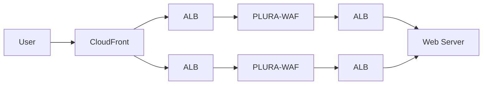
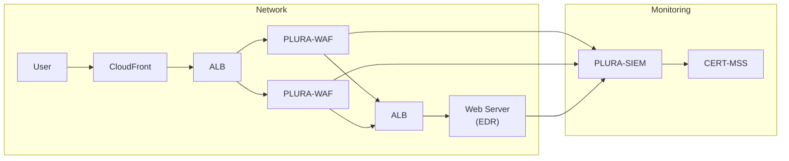
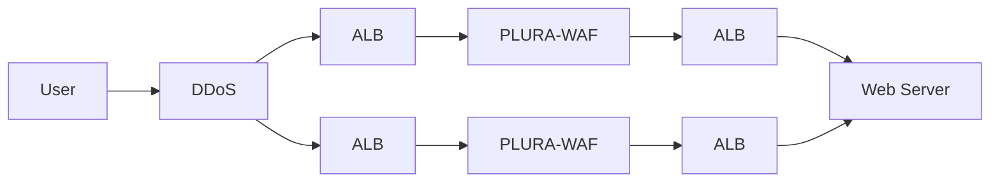
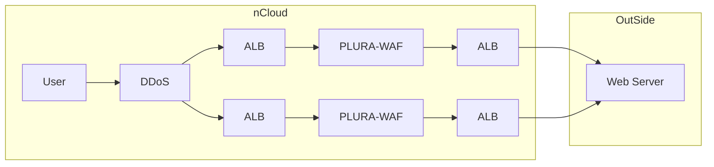

# PLURA-XDR Diagram

## PLURA-WAF

```mermaid
flowchart LR
    User --> CloudFront
    CloudFront --> ALB1[ALB]
    CloudFront --> ALB2[ALB]
    
    ALB1 --> PLURA-WAF1[PLURA-WAF]
    ALB2 --> PLURA-WAF2[PLURA-WAF]
    
    PLURA-WAF1 --> ALB3[ALB]
    PLURA-WAF2 --> ALB4[ALB]

    ALB3 --> WebServer[Web Server]
    ALB4 --> WebServer[Web Server]
```

---

## PLURA-XDR

```mermaid
flowchart LR
    subgraph Network
        User --> CloudFront
        CloudFront --> ALB1[ALB]
        
        ALB1 --> PLURA-WAF1[PLURA-WAF]
        ALB1 --> PLURA-WAF2[PLURA-WAF]
        
        PLURA-WAF1 --> ALB2[ALB]
        PLURA-WAF2 --> ALB2[ALB]

        ALB2 --> WebServer["Web Server<br>(EDR)"]
    end

    subgraph Monitoring
        PLURA-SIEM[PLURA-SIEM] --> CERT-MSS[CERT-MSS]
    end 

    PLURA-WAF1 --> PLURA-SIEM
    PLURA-WAF2 --> PLURA-SIEM
    WebServer --> PLURA-SIEM
```
---

# xWAF.io

## nCloud

```mermaid
flowchart LR
    User --> DDoS
    DDoS --> ALB1[ALB]
    DDoS --> ALB2[ALB]
    
    ALB1 --> PLURA-WAF1[PLURA-WAF]
    ALB2 --> PLURA-WAF2[PLURA-WAF]
    
    PLURA-WAF1 --> ALB3[ALB]
    PLURA-WAF2 --> ALB4[ALB]

    ALB3 --> WebServer[Web Server]
    ALB4 --> WebServer[Web Server]
```

```mermaid
flowchart LR
    subgraph nCloud
		User --> DDoS
		DDoS --> ALB1[ALB]
		DDoS --> ALB2[ALB]
		
		ALB1 --> PLURA-WAF1[PLURA-WAF]
		ALB2 --> PLURA-WAF2[PLURA-WAF]
		
	    PLURA-WAF1 --> ALB3[ALB]
		PLURA-WAF2 --> ALB4[ALB]
    end

    subgraph OutSide
		ALB3 --> WebServer[Web Server]
		ALB4 --> WebServer[Web Server]
    end 
```

---

