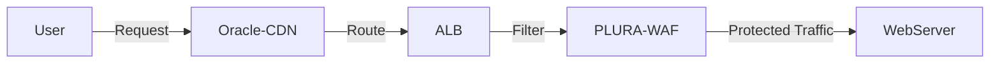
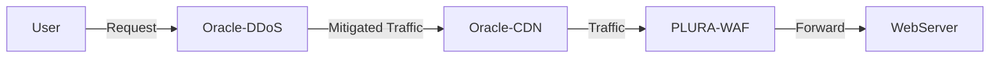

## 1. 기존 AWS 고객을 오라클로 윈백하기 위한 전략

1. **AWS 대비 비용 경쟁력 확보**  
   - 기존 AWS 고객이 주로 사용하는 CDN(AWS CloudFront) 대신 **오라클 CDN(Oracle-CDN)** 을 이용함으로써 비용 절감  
   - PLURA-WAF 서비스를 평상시 사용하되, **DDoS 공격 시점**에만 오라클의 안티 DDoS를 연동하여 방어 → 불필요한 상시 비용 감소

2. **안티 DDoS(Oracle-DDoS)로 보안 신뢰도 제고**  
   - 대규모 DDoS 공격은 단순 WAF만으로 대응이 어려울 수 있음  
   - **오라클 DDoS 방어 서비스**와 연동하면, 공격 발생 기간에만 DDoS 방어 구간을 활성화 → 확실한 보호와 비용 효율 동시에 달성

3. **단계적 도입으로 부담 완화**  
   - 평상시에는 **PLURA-WAF**로 웹 트래픽 보안을 유지하고,  
   - 필요한 경우(공격 시) API 전환(또는 설정 전환)만으로 **오라클 인프라**를 활용  
   - 기존 AWS 환경에서 **오라클 OCI**로 점진적으로 이전 → 고객 입장에서 부담이 덜하고 오라클 윈백 전략에도 부합

4. **PLURA-WAF + Oracle-DDoS 연동의 간편성**  
   - PLURA-WAF가 기본적으로 애플리케이션 레벨 보안을 담당  
   - DDoS 공격이 본격 발생하면 **Oracle-DDoS**를 통해 트래픽을 먼저 방어  
   - 공격이 차단된 정상 트래픽만 WAF → 웹 서버로 전달 → 보안 가시성과 제어권 유지

---

## 2. 전체 서비스 구성

아래는 이 전략을 구현한 **2가지 시나리오**입니다.

### 🅰️ 시나리오 A: 기본 상태 (PLURA-WAF 중심 운영)

- **User**: 최종 사용자  
- **Oracle-CDN**: 오라클의 CDN 서비스 (기존 AWS CloudFront 대체)  
- **ALB**: 로드 밸런싱 (오라클의 LB로 이전 가능)  
- **PLURA-WAF**: 웹 방화벽, 평상시 트래픽 필터링 & 보안  
- **WebServer**: 실제 웹 서비스(오라클 Compute 등)  

> **정상 상황**  
> 1. 사용자 요청 → Oracle-CDN → ALB 순으로 전달  
> 2. ALB에서 트래픽을 **PLURA-WAF**로 라우팅  
> 3. **PLURA-WAF**가 애플리케이션 레벨 필터링 후 **WebServer**로 최종 전달  

---

### 🅱️ 시나리오 B: DDoS 발생 시 (오라클 DDoS 방어 연동)

- **Oracle-DDoS**: 오라클의 DDoS 방어 서비스  

> **DDoS 공격 상황**  
> 1. **User**의 요청이 **Oracle-DDoS**로 먼저 들어오면, 대규모 DDoS 공격을 감지·차단  
> 2. **정상화된(정제된) 트래픽**만 **Oracle-CDN**으로 전달  
> 3. **Oracle-CDN** → **PLURA-WAF**로 이어지면서, WAF가 추가 필터링  
> 4. **WebServer**로 안전하게 최종 도달  

---

## 3. 결론

- **기존 AWS 고객**은 PLURA-WAF + Oracle-DDoS 연동을 통해 **보안 강화**와 **비용 절감**을 동시에 노릴 수 있습니다.  
- **오라클 입장**에서는 AWS에서 OCI로의 **윈백(Win-Back)** 을 유도할 수 있어, 양쪽 모두에게 이점이 되는 구조입니다.  
- **DDoS 공격**이 발생할 때만 **Oracle-DDoS**를 활성화하여, **필요 시점에만 추가 비용**을 지불 → 효율적이고 합리적인 보안 아키텍처 구현.  
