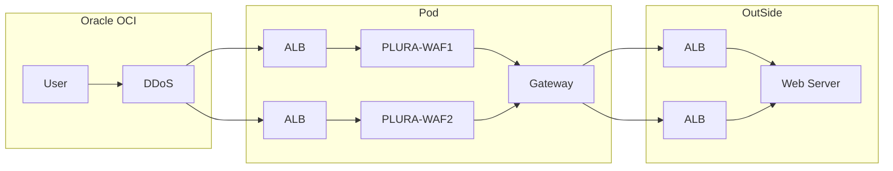

# 🧱 PLURA-XDR Architecture Overview

본 문서는 PLURA-XDR의 주요 구성 요소인 **PLURA-WAF**, **PLURA-XDR 통합 보안 플랫폼**, 그리고 **xWAF.io** (Oracle OCI 기반)의 네트워크 아키텍처를 시각화하고 설명합니다. 각 구성은 보안성, 확장성, 그리고 실시간 탐지/대응 기능을 중심으로 설계되어 있습니다.

---

## 🔰 1. PLURA-WAF 구성

```mermaid
flowchart LR
    User --> CloudFront
    CloudFront --> ALB1[ALB]
    CloudFront --> ALB2[ALB]
    
    ALB1 --> PLURA-WAF1[PLURA-WAF]
    ALB2 --> PLURA-WAF2[PLURA-WAF]
    
    PLURA-WAF1 --> ALB3[ALB]
    PLURA-WAF2 --> ALB4[ALB]

    ALB3 --> WebServer[Web Server]
    ALB4 --> WebServer[Web Server]
````

### ✔️ 설명

* AWS CloudFront와 ALB(Application Load Balancer)를 통해 **고가용성 구조**를 구성합니다.
* **PLURA-WAF**는 리버스 프록시 방식으로 배치되며, 웹 트래픽을 실시간 분석 및 차단합니다.
* 이중화된 구조를 통해 장애 시 자동 우회가 가능하며, 웹서버에는 최종적으로 클린 트래픽만 전달됩니다.

---

## 🛡️ 2. PLURA-XDR 통합 플랫폼

```mermaid
flowchart LR
    subgraph Network
        User --> CloudFront
        CloudFront --> ALB1[ALB]
        
        ALB1 --> PLURA-WAF1[PLURA-WAF]
        ALB1 --> PLURA-WAF2[PLURA-WAF]
        
        PLURA-WAF1 --> ALB2[ALB]
        PLURA-WAF2 --> ALB2[ALB]

        ALB2 --> WebServer["Web Server<br>(EDR)"]
    end

    subgraph Monitoring
        PLURA-SIEM[PLURA-SIEM] --> CERT-MSS[CERT-MSS]
    end 

    PLURA-WAF1 --> PLURA-SIEM
    PLURA-WAF2 --> PLURA-SIEM
    WebServer --> PLURA-SIEM
```

### ✔️ 설명

* **PLURA-XDR**는 WAF, EDR, SIEM을 연동한 통합 사이버 보안 플랫폼입니다.
* 각 보안 요소는 로그를 **PLURA-SIEM**으로 실시간 전송하여 상관 분석이 수행됩니다.
* 분석된 정보는 **SOC**(Security Operation Center, 보안관제팀)으로 전달되어 대응 체계를 강화합니다.
* 이 구조는 **MITRE ATT\&CK 기반 탐지 및 대응**을 지원합니다.

---

## 🌐 3. xWAF.io (Oracle OCI 기반)



### ✔️ 설명

* Oracle OCI 환경에 배포된 **xWAF.io** 구조로, **DDoS 보호 → ALB → WAF → Gateway → Web Server** 단계로 구성됩니다.
* WAF는 컨테이너 기반 환경(Pod) 내에서 동작하며, 유연한 오토스케일링 구조를 지원합니다.
* xWAF는 미러링 방식 또는 경량화된 에이전트 방식을 통해 운영되며, **웹 본문 분석** 및 **로그 기반 공격 탐지**에 최적화되어 있습니다.

---

## 🧩 요약 비교

| 항목    | PLURA-WAF       | PLURA-XDR        | xWAF.io (OCI)              |
| ----- | --------------- | ---------------- | -------------------------- |
| 방식    | 리버스 프록시         | 통합 보안 플랫폼        | 미러 기반 또는 경량 에이전트           |
| 구성    | ALB → WAF → Web | WAF + EDR + SIEM | DDoS → WAF → Gateway → Web |
| 로그 연동 | X               | O (SIEM 연동)      | O (클라우드 로그 분석 기반)          |
| 배포 환경 | AWS             | AWS 또는 온프레미스     | Oracle OCI                 |
| 특징    | WAF 단독 운용       | WAF + EDR + 분석   | 경량 구성 + 고성능                |

---

> 📌 본 문서는 보안 아키텍처 설계 시 참고용이며, 실제 환경에 따라 IP 구성, 인증 체계, 로깅 정책은 달라질 수 있습니다.

---
