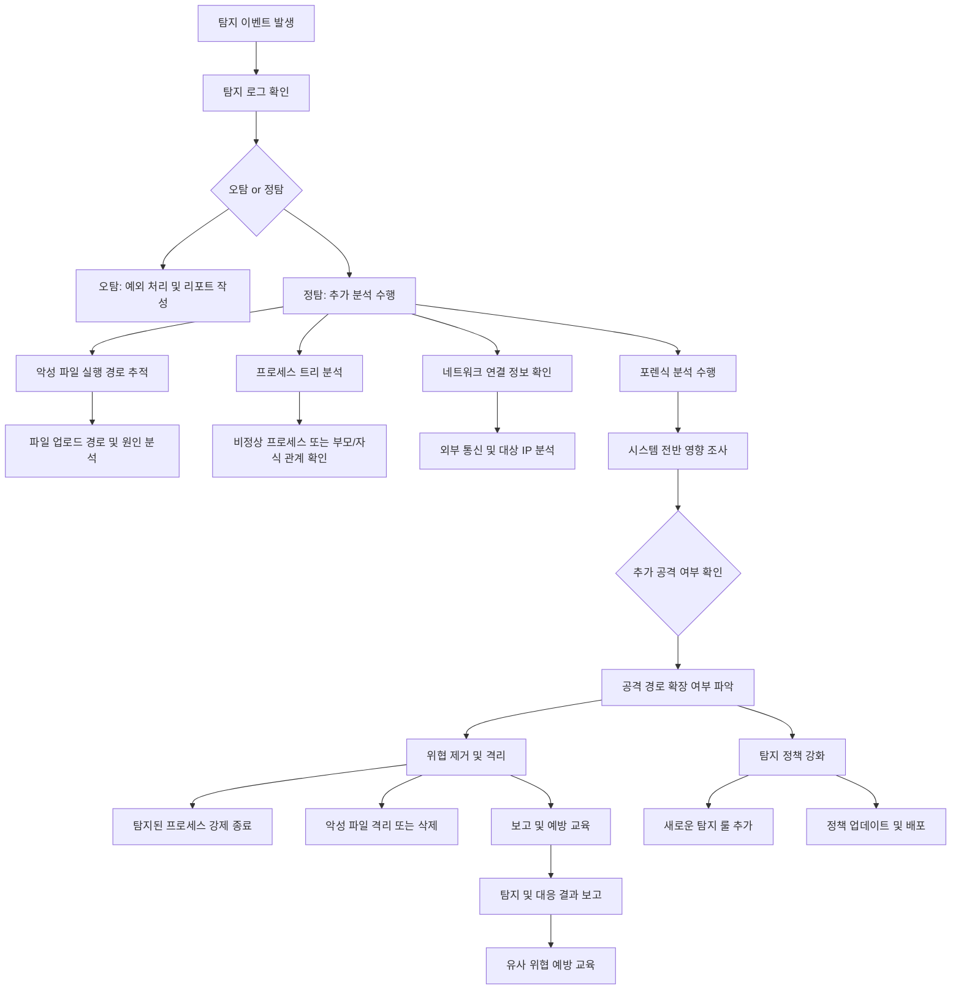

### **1) EDR에서 탐지되었을 경우**

---

#### **탐지 시나리오**

- **악성 파일 실행**
  - 시스템 내에서 탐지된 의심 파일의 실행 이벤트.
  - 바이러스, 랜섬웨어 또는 기타 악성 코드의 실행 가능성.

- **비정상적인 프로세스 동작**
  - 정상 범위를 벗어난 CPU, 메모리 사용량.
  - 비인가된 실행 파일, DLL 삽입 또는 권한 상승 시도.

- **의심스러운 네트워크 통신 시도**
  - 의심스러운 IP/도메인과의 통신.
  - 데이터 유출을 시도하거나 명령 제어 서버(C&C)로 보이는 활동.

---

#### **분석 프로세스**

---

##### **1. 이벤트 확인 및 분류**

1. **EDR 탐지 로그 확인:**
   - PLURA-XDR의 대시보드에서 탐지된 위협 로그 확인.
   - 발생 시각, 탐지된 파일 이름, 프로세스 ID 등 세부 정보 검토.

2. **위협 유형 및 심각도 분류:**
   - 위협 유형(악성 파일 실행, 네트워크 통신, 비정상 프로세스)을 명확히 정의.
   - MITRE ATT&CK 매핑을 통해 해당 위협이 가능한 공격 벡터인지 분석.

3. **오탐/정탐 판별:**
   - 의심 파일 해시를 VirusTotal, Threat Intelligence 플랫폼 등에서 조회.
   - 기존 허용 목록(화이트리스트) 또는 정책과 비교하여 오탐 여부 확인.
   - **오탐**일 경우: 예외 처리 또는 관리자 리포트 작성.
   - **정탐**일 경우: 추가 조사를 통해 침해 가능성 분석.

---

##### **2. 위협 세부 정보 확인**

1. **악성 파일의 실행 경로 분석:**
   - 탐지된 파일의 원본 위치(업로드 또는 생성된 경로) 추적.
   - 파일이 내부 또는 외부 경로를 통해 유입되었는지 확인.

2. **파일 속성 및 동작 분석:**
   - 파일 해시 값을 기반으로 정적 분석 수행.
   - 동적 분석 환경(샌드박스)을 통해 파일 실행 시 행동 패턴 추적.

3. **프로세스 트리 분석:**
   - 파일을 실행한 부모/자식 프로세스 트리 확인.
   - 비정상적인 자식 프로세스 생성 여부 검토.

4. **네트워크 연결 정보 확인:**
   - 탐지된 프로세스와 연관된 외부 통신 기록 분석.
   - DNS 요청, HTTP/S 통신 여부 및 대상 IP 분석.

---

##### **3. 행위 기반 분석**

1. **시스템 파일 접근 이력 확인:**
   - 악성 파일이 시스템의 중요 파일에 접근했는지 조사.
   - 레지스트리 변경 내역 추적.

2. **침해 범위 조사:**
   - 파일 또는 프로세스가 다른 시스템 영역에 전파되었는지 확인.
   - 포렌식 툴(예: PLURA-Forensic)을 사용하여 메모리 덤프 및 디스크 분석.

3. **잠재적 추가 위협 분석:**
   - 유사한 탐지 로그를 기반으로 잠재적 위협 식별.
   - 동일 공격자가 사용하는 다른 패턴 탐지.

---

##### **4. 조치**

1. **위협 제거 및 격리:**
   - 탐지된 프로세스 강제 종료.
   - 해당 파일 격리 또는 삭제.
   - 추가적인 프로세스 생성 차단(정책 업데이트).

2. **시스템 격리 및 사용자 차단:**
   - 감염 시스템 네트워크 격리.
   - 악성 활동과 관련된 계정 잠금 조치.

3. **탐지 정책 강화:**
   - 동일한 유형의 위협을 사전에 차단할 수 있도록 정책 업데이트.
   - PLURA-XDR에 새로운 탐지 룰 추가.

4. **보고 및 교육:**
   - 탐지 및 대응 결과 보고서 작성.
   - 유사 위협에 대한 예방 교육 제공.

---

#### **예시: 악성 파일 탐지 상세 프로세스**

1. **악성 파일 실행이 탐지되었을 경우:**
   - 탐지된 로그로 이동하여 이벤트를 확인합니다.
   - 악성 파일의 해시 값과 실행 경로를 추적합니다.
   - 파일 업로드 경로 및 타임라인을 분석하여 감염 원인을 파악합니다.

2. **오탐인 경우:**
   - 의심 파일을 예외 처리 목록에 추가하거나 리포트를 작성합니다.

3. **정탐인 경우:**
   - 포렌식을 통해 시스템 전반의 영향을 분석합니다.
   - 동일 위협의 재발 방지를 위해 정책 강화 및 담당자 보고.

---

---

이와 같이 각 탐지 이벤트에 대해 상세한 프로세스를 수행하여 침해 가능성을 신속히 평가하고, 효율적인 대응을 지원합니다.
