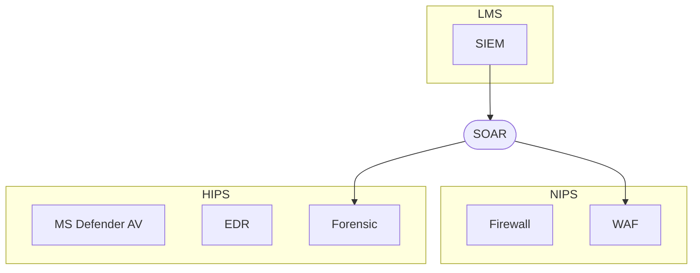
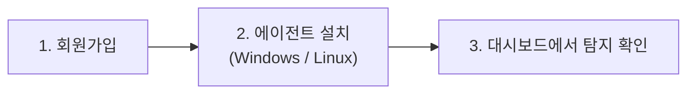

# 클라우드 SaaS **PLURA-XDR** 소개 자료

> **PLURA-XDR**는 WAF·EDR·Forensic·SMS·SOAR·SIEM을 하나의 **클라우드 SECaaS**로 수직 통합하여, **MITRE ATT\&CK** 기반의 실시간 탐지/자동대응과 **Zero Trust** 구현을 돕는 통합 보안 플랫폼입니다. 또한 웹 요청/응답 본문(Post/Resp-Body)까지 로깅·분석해 자격증명 오용·데이터유출 등 웹 공격에 강력히 대응합니다. ([Plura][1])

---

## 1) 한눈에 보는 PLURA-XDR

* **수직 통합 보안**: WAF, EDR, Forensic, SMS, SOAR, SIEM 모듈이 클라우드에서 유기적으로 연동되어 탐지→분석→대응→보고까지 단일 흐름으로 처리. ([Plura][1])
* **MITRE ATT\&CK & ZTA 지향**: 크리덴셜 스터핑·APT 등 전술/기술 기반 탐지와 Zero Trust 구성요소 제공. ([Plura][1])
* **본문까지 보는 로깅**: 서버/PC 감사(event)와 더불어 **웹 요청/응답 본문** 로깅·분석을 지원해 난해한 공격도 정밀 대응. ([Plura][1])
* **클라우드 도입 용이성**: 장비 없이 에이전트만 설치하면 실시간 분석·알림, 운영부하 최소화의 SaaS 모델. ([QubitSec][2])
* **실전 데모/사례 제공**: 크리덴셜 스터핑, SQLi 데이터유출, 웹쉘, XSS, Emotet/Log4Shell/WannaCry, APT29 등 다수의 시연·사례. ([Plura][1])

---

## 2) 구성 요소 & 주요 기능

### A. 모듈 구성 — 한 팀처럼 움직이는 6개 포지션

* 🧱 **WAF** — *문 앞을 지키는 문지기*
  공격 패턴·봇·대량 시도를 입구에서 걸러내고, 필요하면 **본문까지** 정밀 점검해 선제 차단합니다.

* 🛡️ **EDR** — *단말을 지키는 보안요원*
  행위 기반 위협을 즉시 포착하고 격리/치료합니다. (Microsoft Defender 연동으로 운영 부담 ↓)

* 🔎 **Forensic** — *사건을 복원하는 CSI*
  증거를 보존하고 타임라인을 복원합니다. **Replay(재현) 테스트**로 탐지를 검증/튜닝합니다.

* 📊 **SIEM** — *모든 것을 보는 상황실*
  전 로그를 한곳에 모아 상관분석·MITRE 매핑·위험점수로 “무엇이 중요한가”를 드러냅니다.

* 🤖 **SOAR / CERT-MSS** — *자동 대응 + 24/7 지원팀*
  플레이북으로 **IP 차단·계정 잠금·티켓 발행**을 자동화하고, 원격 관제로 공백을 줄입니다.

* ⏱️ **SMS** — *인프라 주치의*
  CPU/메모리/디스크/서비스·NTP 시각을 수시로 점검해, 이상 징후를 먼저 알려줍니다.

> 이 여섯 역할이 합쳐져 **PLURA-XDR**입니다.  
> **SaaS 특성상 항상 최신**을 유지하며 지속적으로 확장됩니다.  
> 🛠️2026 예정: AI에이전트, 브루트포스 대응, 제로데이 고도화, Mermaid 랙/네트워크 관리, Microsoft Defender 운영, NTP 동기화 등

> #### 💡 이렇게 이해하면 가장 쉽습니다
>
> “**WAF**는 막고, **EDR**은 지키고, **SIEM**은 보고, **SOAR**는 움직이고, **Forensic**은 밝히고, **SMS**는 미리 알려준다.”
>
> → **PLURA-XDR 플랫폼 소개 바로 가기** [↗️][4]

---

### B. 핵심 기능 — 고객이 바로 체감하는 포인트

* 🤖 **AI 기반 다층 탐지**  
  룰·통계·상관분석에 **LLM 보조 판단**을 더해 변종·우회 트래픽까지 포착합니다. “왜 탐지됐는가”를 한 문장 설명으로 제공합니다.

* 🐚 **웹쉘(WEBSHELL) 즉시 탐지·차단**  
  업로드·실행·C2 통신까지 **행위 흐름**으로 감지합니다. 난독화/우회 패턴도 본문 단서까지 확인해 **원클릭 차단**합니다.

* 🗺️ **MITRE ATT\&CK 매핑 가시화**  
  탐지 이벤트를 TTP와 **그룹/소프트웨어**에 연결해 “현재 공격이 **어느 단계**인지, **무엇을 막았고 무엇이 남았는지**”를 한눈에 보여줍니다.

* 🔍 **본문까지 보는 웹 분석(Post/Resp-Body)**  
  헤더·URI를 넘어 **요청/응답 본문 파라미터**를 정규화·비교해 **데이터 유출·파라미터 변조**를 조기에 식별합니다.

* 🎯 **재현 가능한 검증(Replay)**  
  탐지된 트래픽을 **원클릭 재전송**해 재현·튜닝·교육에 활용합니다. “탐지 규칙이 실제로 어떻게 작동하는지”를 즉시 확인합니다.

* ⚡ **자동 대응(SOAR)**  
  **IP 차단, 계정 잠금, 티켓 발행, 알림**을 시나리오로 자동화합니다. 반복 작업을 줄이고 MTTR을 단축합니다.

* 🧭 **통합 로그·타임라인 추적**  
  호스트/웹/네트워크 전 범위를 **한 화면**에서 상관 분석하고, 사건의 **전후 맥락 타임라인**을 복원합니다.

* 📈 **리포트 & 알림**  
  위협 Top N, 서비스 영향, 규정 준수 뷰를 제공해 **의사결정 속도**를 높입니다. (SaaS로 **항상 최신** 기능/룰 자동 적용)

---

## 3) 왜 PLURA-XDR인가? (고객 가치)

* 🤖 **정확도·가시성 극대화** — 룰·상관·ML에 더해 본문(Post/Resp-Body)까지 분석하여 은닉 공격·데이터 유출 징후를 조기 포착합니다.  
* 🚀 **SaaS = 항상 최신** — 장비/인력 증설 없이 실시간 분석·알림을 제공하고, 룰·대시보드·보고서·매트릭스는 자동 업데이트됩니다.  
* 🔗 **엔드-투-엔드 흐름** — 수집→정규화→상관/ML→대응→보고를 한 화면에서 처리하고, **MITRE ATT&CK** 뷰로 공격 단계를 직관적으로 파악합니다.  
* 🧪 **검증과 재현(Replay)** — 실제 공격 **데모/사례 영상**과 **원클릭 재현**으로 도입 전 이해·튜닝이 쉽습니다.  
* 📊 **의사결정 가속 리포트** — 위협 Top N, 서비스 영향, 컴플라이언스 지표를 자동 생성해 임원/현장 모두에 필요한 정보를 제공합니다.  
* 🛡️ **신뢰 가능한 레퍼런스** — 플랫폼 가치와 특허·레퍼런스는 **기업 홈페이지**에서 확인할 수 있습니다.  

---

## 4) 도입 & 시작 방법 — **3단계, 3분이면 충분**

1️⃣ **회원가입** — 계정 생성 후 로그인.  
2️⃣ **에이전트 설치(Windows/Linux)** — 가이드대로 명령 1–2줄로 설치.  
3️⃣ **대시보드에서 탐지 확인** — 기본 정책 활성화 상태에서 실시간 이벤트·경보 확인.  

👉 **3분 퀵스타트 바로가기**: [https://docs.plura.io/ko/quickstart](https://docs.plura.io/ko/quickstart)

---

## 5) 2026년 로드맵

* **브루트포스 공격 대응**: 로그인 성공/실패와 무관하게 **입력값 결과 기반**의 대량 시도·무작위 대입 패턴을 고속 탐지·차단.
* **제로데이 공격 대응 고도화**: 서명·룰 우회 행위에 대한 **행위/상관/LLM 보조 분석** 강화.
* **시스템 관리 강화**: **Mermaid 기반 랙/네트워크 다이어그램** 자동 상태 반영(그룹별 상태 API 연동).
* **Microsoft Defender 운영 관리**: 정책·경보·상태 연동으로 엔드포인트 관리 일원화.
* **NTP 시간 동기화 관리**: 조직 전반 시간 기준 점검/경보로 포렌식·상관분석 신뢰도 제고.

> *상기 항목은 2026년 순차 제공 예정(세부 범위/일정은 고지 없이 변경될 수 있음).*

---

## 6) 더 많은 자료

* **플랫폼 소개**: *Cloud SaaS 개요·구성·가치*. ([PLURA-XDR][1])
* **플래폼 매뉴얼**: *설치/운영/정책/FAQ*. ([PLURA-DOC][2])
* **블로그**: *최신 공격 트렌드·대응 사례·제품 철학*. ([PLURA-BLOG][3])
* **빠르게 시작하기(3분)**: *회원가입 → 에이전트 설치 → 대시보드 확인*. ([PLURA-DOC][4])
* **회사 소개**: *비전·특허·레퍼런스*. ([Qubit Security][5])

---

### 부록: 데모 주제

* 💡 **PLURA-XDR 철학** — 왜 “본문까지” 보며 통합(XDR)로 가는가를 설명합니다. [↗️](https://w.plura.io/index.html?doc=/philosophy/ko/README.md)

* 📈 **도입 효과** — TCO 절감, 운영 간소화, 탐지 정확도 향상 포인트를 정리했습니다.[↗️](https://w.plura.io/index.html?doc=/benefits/ko/xdr_custom_value-added_service.md)

* 🧭 **솔루션 선택 가이드** *(오탈자 수정: ‘플랫’ → ‘솔루션/플랫폼’)* — 조달·기능·운영 편의 체크리스트로 비교 기준을 제시합니다.[↗️](https://w.plura.io/index.html?doc=/benefits/ko/cybersecurity-solution-selection-guide.md)

* 🔎 **APT·랜섬웨어: 숨겨진 백도어 탐지** — 행위 흐름·MITRE 매핑·웹쉘 단서로 은닉 위협을 드러냅니다.[↗️](https://w.plura.io/index.html?doc=/benefits/ko/reveal-backdoor.md)

* 🧪 **사례: SKT BPFDoor 해킹 분석** — 침투 가설과 방어 인사이트를 요약한 케이스 스터디.[↗️](https://blog.plura.io/ko/column/skt-hacking-hypothesis/)

---

[1]: https://www.plura.io/ko/ "PLURA-XDR 플랫폼 소개"
[2]: https://docs.plura.io/ko/ "PLURA-XDR 플랫폼 사용자 매뉴얼"
[3]: https://blog.plura.io/ko/ "PLURA-BLOG"
[4]: https://docs.plura.io/ko/quickstart "PLURA-XDR 빠르게 시작하기"
[5]: https://www.qubitsec.com/service "[회사홈페이지] PLURA-XDR Cloud SaaS Cybersecurity Platform"
