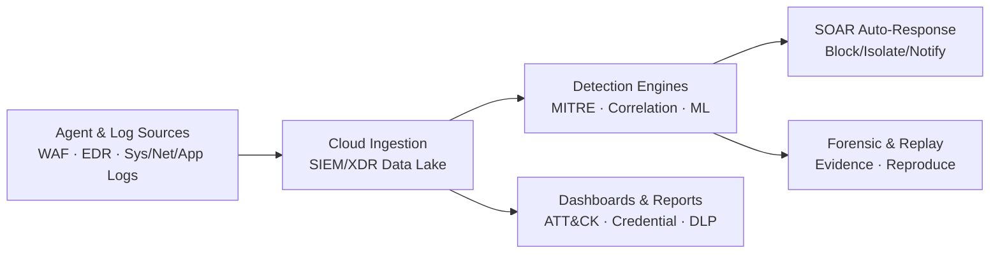

# 클라우드 SaaS **PLURA-XDR** 소개 자료

> **PLURA-XDR**는 WAF·EDR·Forensic·SMS·SOAR·SIEM을 하나의 **클라우드 SECaaS**로 수직 통합하여, **MITRE ATT\&CK** 기반의 실시간 탐지/자동대응과 **Zero Trust** 구현을 돕는 통합 보안 플랫폼입니다. 또한 웹 요청/응답 본문(Post/Resp-Body)까지 로깅·분석해 자격증명 오용·데이터유출 등 웹 공격에 강력히 대응합니다. ([Plura][1])

---

## 1) 한눈에 보는 PLURA-XDR

* **수직 통합 보안**: WAF, EDR, Forensic, SMS, SOAR, SIEM 모듈이 클라우드에서 유기적으로 연동되어 탐지→분석→대응→보고까지 단일 흐름으로 처리. ([Plura][1])
* **MITRE ATT\&CK & ZTA 지향**: 크리덴셜 스터핑·APT 등 전술/기술 기반 탐지와 Zero Trust 구성요소 제공. ([Plura][1])
* **본문까지 보는 로깅**: 서버/PC 감사(event)와 더불어 **웹 요청/응답 본문** 로깅·분석을 지원해 난해한 공격도 정밀 대응. ([Plura][1])
* **클라우드 도입 용이성**: 장비 없이 에이전트만 설치하면 실시간 분석·알림, 운영부하 최소화의 SaaS 모델. ([QubitSec][2])
* **실전 데모/사례 제공**: 크리덴셜 스터핑, SQLi 데이터유출, 웹쉘, XSS, Emotet/Log4Shell/WannaCry, APT29 등 다수의 시연·사례. ([Plura][1])

[PLURA-XDR Diagram](https://purplecow.plura.io/web/index_v6.0/assets/images/xdr_01.png)

---

## 2) 구성 요소 & 주요 기능

### A. 모듈 구성

* **PLURA-WAF**(웹방화벽) · **PLURA-EDR**(호스트보안) · **PLURA-Forensic** · **PLURA-SMS**(리소스 모니터링) · **PLURA-SIEM** · **PLURA-CERT-MSS**(원격 관제) = **PLURA-XDR**. 
* 제품 소개 (↗️][3])  

### B. 대표 기능

* **대시보드/리포트/통계**: 운영/보안 현황 시각화, 마이터 어택/계정탈취/데이터유출 분석 리포트. ([Plura][1])
* **보안탐지 팩**:

  * *마이터 어택 매트릭스/리스트/해킹그룹/소프트웨어* 뷰,
  * *상관분석·ML탐지*,
  * *데이터 유출*, *계정 탈취*, *홈페이지 위변조* 등. ([Plura][1])
* **전체 로그/추출 로그**: 호스트/웹/응용/네트워크 전 범위 수집·검색·IP·Login·URL 추출 뷰. ([Plura][1])
* **방어·차단**: 즉시 차단/차단 IP 관리 등 대응 기능. ([Plura][1])
* **모의해킹 지원**: *재전송(Replay) 공격 사용 안내*로 탐지 조건 재현·튜닝 지원. ([Plura][1])

---

## 3) 왜 PLURA-XDR인가? (고객 가치)

* **탐지 정확도 & 가시성**: 헤더/URI를 넘어 \*\*본문(Post/Resp-Body)\*\*까지 분석해 은닉 공격·데이터유출 징후를 조기 포착. ([Plura][1])
* **운영 효율성**: 장비·인력 추가 없이 **SaaS형** 실시간 분석/알람으로 반복 업무 부담을 대폭 경감. ([QubitSec][2])
* **엔드-투-엔드 흐름**: 수집→정규화→상관/ML→대응→보고까지 한 화면에서 추적·조치. ([Plura][3])
* **검증된 스토리**: 다양한 웹·시스템 공격 **데모/사례 영상** 제공으로 도입 전 이해·검증 용이. ([Plura][1])
* **기업 홈페이지**에 요약된 플랫폼 가치와 특허 보유 현황 참고. ([qubitsec.com][4])

---

## 4) 아키텍처 개요 (개념도)

> 실제 서비스 화면·상세 도식은 **문서/다이어그램 리포지토리**를 참고하세요. (GitHub: `/xdr/ko/diagram`)

---

## 5) 도입 & 시작 방법

1. **회원가입/로그인** → **에이전트 설치** (Windows/Linux, Sysmon 포함 가이드 제공)
2. **웹/WAF/네트워크/응용 로그 연동**(PLC·Syslog 등)
3. **보안탐지/상관분석/ML탐지** 기본 정책 활성화, **대시보드/보고서** 확인
4. 필요 시 **즉시 차단/차단 IP 관리/알림** 설정, **모의해킹(재전송) 테스트**로 탐지율 튜닝
   *세부 가이드는 제품 문서 내 “시작하기/에이전트 설치/연동/모의해킹” 항목을 참고하세요.* ([Plura][1])

---

## 6) 2026 로드맵(업데이트 예정)

* **브루트포스 공격 대응**: 로그인 성공/실패와 무관하게 **입력값 결과 기반**의 대량 시도·무작위 대입 패턴을 고속 탐지·차단.
* **제로데이 공격 대응 고도화**: 서명·룰 우회 행위에 대한 **행위/상관/LLM 보조 분석** 강화.
* **시스템 관리 강화**: **Mermaid 기반 랙/네트워크 다이어그램** 자동 상태 반영(그룹별 상태 API 연동).
* **Microsoft Defender 운영 관리**: 정책·경보·상태 연동으로 엔드포인트 관리 일원화.
* **NTP 시간 동기화 관리**: 조직 전반 시간 기준 점검/경보로 포렌식·상관분석 신뢰도 제고.

> *상기 항목은 2026년 순차 제공 예정(세부 범위/일정은 고지 없이 변경될 수 있음).*

---

## 7) 참고 링크

* **제품 소개(문서/영상)**: docs.plura.io – *제품 > 『PLURA-XDR』 Cloud SECaaS Platform*, *해킹탐지 시연/고객 사례* 섹션. ([Plura][1])
* **제품 매뉴얼 홈**: *PLURA-XDR 사용법(모듈 구성/철학)*. ([Plura][3])
* **기업/플랫폼 개요**: qubitsec.com *(AI · PLURA-XDR 개요/특허/파트너)*, w\.qubitsec.com *(SaaS 서비스 설명)*. ([qubitsec.com][4])
* **다이어그램 리포지토리**: GitHub `/xdr/ko/diagram` *(구성도 자료 모음).* (사용자 제공 링크)

---

### 부록: 데모 주제(발췌)

* **Web**: 크리덴셜 스터핑, SQL 삽입 기반 데이터 유출, 웹쉘, XSS 등
* **System**: Emotet, Log4Shell, WannaCry, APT29 등
  → 각 데모는 제품 문서의 *해킹탐지 시연* 섹션에서 확인 가능합니다. ([Plura][1])

---

필요하시면 이 문서를 **회사 홈페이지/제안서/IR 자료** 형식에 맞춰 **영문/일문** 버전으로도 바로 변환해 드릴게요.

[1]: https://docs.plura.io/ko/video/company/product "제품 | Korean"
[2]: https://w.qubitsec.com/en/service.html?utm_source=chatgpt.com "SERVICE"
[3]: https://docs.plura.io/ko "PLURA-XDR 제품 소개"
[4]: https://www.qubitsec.com/?utm_source=chatgpt.com "PLURA-XDR Cloud SaaS Cybersecurity Platform"
